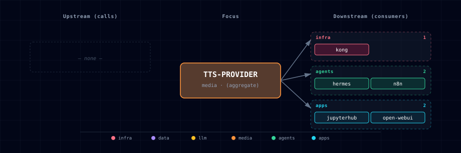

# 5.2.57. TTS Provider

Pluggable text-to-speech layer. All backends speak the OpenAI
`/v1/audio/speech` protocol, so Open WebUI, n8n, JupyterHub and Hermes call
them the same way.

## 1. Source matrix

| `TTS_PROVIDER_SOURCE` | Engine | Container image | License | Hardware |
|---|---|---|---|---|
| `speaches-container-cpu` (default) | Speaches → Kokoro / Piper | `ghcr.io/speaches-ai/speaches:0.9.0-rc.3-cpu` | MIT | Linux + macOS Docker, CPU |
| `speaches-container-gpu` | Speaches → Kokoro / Piper | `ghcr.io/speaches-ai/speaches:0.9.0-rc.3-cuda` | MIT | Not usable yet: CUDA image, but no GPU device is attached (#1373) |
| `chatterbox-container-gpu` | Resemble AI Chatterbox | `travisvn/chatterbox-tts-api:gpu`, pinned by digest | AGPL-3.0 (API server); model MIT | NVIDIA (upstream recommends 8 GB+ memory) |
| `chatterbox-localhost` | Resemble AI Chatterbox | — (git clone + `uv run main.py`) | AGPL-3.0 (API server); model MIT | macOS MPS / Linux |
| `disabled` | — | — | — | — |

When TTS and STT both select Speaches, one container serves both endpoints.
If one selects the CPU variant and the other the GPU variant, the GPU variant
wins and the bootstrapper prints a one-line notice.

> **GPU limitation:** the `speaches` compose service requests no NVIDIA runtime
> or device (issue #1373, open). `speaches-container-gpu` therefore gets no GPU:
> it runs on CPU or fails CUDA initialisation. Use `speaches-container-cpu`, or
> `chatterbox-container-gpu` for GPU synthesis.

## 2. Engine comparison

| | Speaches (Kokoro) | Speaches (Piper) | Chatterbox |
|---|---|---|---|
| Model | Kokoro-82M, one model with many voices | one model per voice | Chatterbox, about 0.5 B parameters |
| Voice cloning | no | no | yes, zero-shot from a short reference clip |
| GPU in Atlas | no (#1373) | no (#1373) | NVIDIA container, or MPS/CUDA on the host |

The default is Speaches with Kokoro. Pick Chatterbox when you need voice
cloning. Speed, quality and language coverage depend on the model, the voice
and the hardware; Atlas publishes no ranking. Benchmark representative text on
the deployment host.

## 3. Quick start

`./start.sh` launches Speaches without a model. Speaches does not download
models itself (verified against `speaches @ v0.9.0-rc.3`), and the compose file
sets `PRELOAD_MODELS: '[]'`. A TTS request returns `404` ("Model is not
installed locally") until you download the Kokoro model (issue #799):

```bash
./start.sh
# Speaches is healthy as soon as Uvicorn is up, but has no model yet.
# Download the Kokoro ONNX build (one-time; persists in the speaches-cache volume):
curl -X POST http://localhost:63060/v1/models/speaches-ai/Kokoro-82M-v1.0-ONNX
# Now synthesize:
curl http://localhost:63060/v1/audio/speech \
  -X POST -H "Content-Type: application/json" \
  -d '{"model":"speaches-ai/Kokoro-82M-v1.0-ONNX","input":"hello world","voice":"af_heart","response_format":"wav"}' \
  --output /tmp/hello.wav
file /tmp/hello.wav   # expect RIFF / WAVE audio
```

To have models ready at boot instead, set `PRELOAD_MODELS` in
`services/speaches/compose.yml` to a **JSON array** of valid repo ids, for
example `'["speaches-ai/Kokoro-82M-v1.0-ONNX","Systran/faster-whisper-large-v3"]'`.
Atlas has no env var for it. Preload downloads block startup, and a bad id
stops Speaches.

Voice cloning via Chatterbox (NVIDIA):

```bash
./start.sh --tts-provider-source chatterbox-container-gpu
# The server loads the model in the background; the first start downloads
# the weights. Requests succeed once /health reports "healthy".
```

Voice cloning via Chatterbox (macOS native, MPS; needs Python 3.11):

```bash
# Terminal 1 — install from git (the PyPI package holds no code):
git clone https://github.com/travisvn/chatterbox-tts-api
cd chatterbox-tts-api && uv sync
PORT=63044 uv run main.py

# Terminal 2
./start.sh --tts-provider-source chatterbox-localhost
```

See [the chatterbox-localhost README](./provider/localhost/README.md)
for the full Chatterbox-on-host walkthrough.

## 4. Environment variables

| Variable | Default | Notes |
|---|---|---|
| `TTS_PROVIDER_SOURCE` | `speaches-container-cpu` | The single dial that drives everything below. |
| `TTS_PROVIDER_PORT` | `63058` | Wizard display slot. When Speaches or Chatterbox runs in a container, the bootstrapper sets it to that engine's port. |
| `TTS_ENDPOINT` | (auto) | Internal URL of the active TTS engine. n8n and JupyterHub read it directly. Open WebUI and Hermes get URLs derived from it. The backend receives it but does not use it. |
| `TTS_PROVIDER_SCALE` | (auto) | 1 when any container variant is active, else 0. |
| `SPEACHES_IMAGE` | `ghcr.io/speaches-ai/speaches:0.9.0-rc.3-cpu` | Override to pin a different release. |
| `SPEACHES_GPU_IMAGE` | `ghcr.io/speaches-ai/speaches:0.9.0-rc.3-cuda` | CUDA build pin. |
| `SPEACHES_TTS_MODEL` | `speaches-ai/Kokoro-82M-v1.0-ONNX` | Model id Open WebUI sends to Speaches. The Kokoro executor needs this ONNX build; the alias `tts-1` resolves to it. It rejects the PyTorch repo `hexgrad/Kokoro-82M`. |
| `SPEACHES_PORT` | `63060` | Speaches container external port. |
| `SPEACHES_SCALE` | (auto) | 1 when speaches is active. |
| `CHATTERBOX_IMAGE` | `travisvn/chatterbox-tts-api:gpu@sha256:8c0b3791…` | Rolling `gpu` tag pinned by digest. To refresh, pull the tag and replace the digest. |
| `CHATTERBOX_PORT` | `63059` | Chatterbox container external port. |
| `CHATTERBOX_LOCALHOST_PORT` | `63044` | Port the stack reaches your host's chatterbox-tts-api on. URL is derived as `http://host.docker.internal:${CHATTERBOX_LOCALHOST_PORT}` at compose-render time. |

Speaches needs the model download in §3. Chatterbox downloads its weights
itself when the server first starts.

## 5. OpenAI-compatible API

Speaches:

```http
POST http://speaches:8000/v1/audio/speech
Content-Type: application/json

{
  "model": "speaches-ai/Kokoro-82M-v1.0-ONNX",
  "input": "Hello world",
  "voice": "af_heart",
  "response_format": "wav"
}
```

Kokoro voices include `af_heart`, `af_sky`, `am_adam`, `am_michael`,
`bf_emma` and `bm_george` (full list at the Kokoro model card).

Each Piper voice is its own model. Speaches accepts only repos named
`<org>/piper-<lang>_<REGION>-<voice>-<quality>`; `rhasspy/piper-voices` does
not load. List the valid ids with
`curl "http://localhost:63060/v1/registry?task=text-to-speech"`. Download one
with `POST /v1/models/<id>`, then send that id as `model`. Piper does not check
`voice`.

Chatterbox (registered/built-in voice — JSON):

```http
POST http://chatterbox:4123/v1/audio/speech
Content-Type: application/json

{
  "model": "chatterbox-tts-1",
  "input": "Hello world",
  "voice": "alloy"
}
```

Chatterbox voice cloning uses **multipart upload**, not a JSON
`reference_audio` field. Either register a voice with `POST /voices`
(fields `voice_name` and `voice_file`) and use its name as `voice`. Or send the
reference clip with the request to `/v1/audio/speech/upload`:

```bash
curl -X POST http://chatterbox:4123/v1/audio/speech/upload \
  -F "input=Hello in this voice." \
  -F "voice_file=@/host/path/to/sample.wav" \
  --output cloned.wav
```

See [the chatterbox-localhost README](./provider/localhost/README.md)
for the full voice-library workflow.

## 6. Open WebUI integration

The bootstrapper writes these values to `.env`; the Open WebUI compose file
maps each to the `AUDIO_TTS_*` variable shown:

| `.env` variable | Open WebUI variable | Value |
|---|---|---|
| `OPEN_WEB_UI_TTS_ENGINE` | `AUDIO_TTS_ENGINE` | `openai` |
| `OPEN_WEB_UI_TTS_API_URL` | `AUDIO_TTS_OPENAI_API_BASE_URL` | `${TTS_ENDPOINT}/v1` |
| `OPEN_WEB_UI_TTS_MODEL` | `AUDIO_TTS_MODEL` | `SPEACHES_TTS_MODEL` (Speaches) or `chatterbox-tts-1` (Chatterbox) |
| `OPEN_WEB_UI_TTS_VOICE` | `AUDIO_TTS_VOICE` | `af_heart` (Speaches) or `alloy` (Chatterbox) |

The compose file hard-codes `AUDIO_TTS_OPENAI_API_KEY=sk-unused`. These are
defaults; change the voice or model later in Open WebUI admin → Settings →
Audio.

## 7. Legacy XTTS values

The XTTS sources were removed. On the next start,
`bootstrapper/services/source_validator.py::_migrate_legacy_tts_stt_sources`
rewrites them in `.env`:

| Old | New |
|---|---|
| `TTS_PROVIDER_SOURCE=xtts-container-gpu` | `speaches-container-gpu` |
| `TTS_PROVIDER_SOURCE=xtts-localhost` | `chatterbox-localhost` |

It also deletes `XTTS_ENDPOINT` from `.env`; `TTS_ENDPOINT` replaces it.

## 8. References

- [Speaches](https://github.com/speaches-ai/speaches)
- [Kokoro-82M model card](https://huggingface.co/hexgrad/Kokoro-82M)
- [Piper voices](https://github.com/OHF-Voice/piper1-gpl)
- [Chatterbox upstream](https://github.com/resemble-ai/chatterbox)
- [chatterbox-tts-api server](https://github.com/travisvn/chatterbox-tts-api)
- [OpenAI Audio API spec](https://platform.openai.com/docs/guides/text-to-speech)

## 9. Dependencies & Integrations

### 9.1. Current — Upstream (this service calls)

_No upstream calls._

### 9.2. Current — Downstream (services that call this)

| Service | Category |
|---|---|
| kong | infra |
| hermes | agents |
| n8n | agents |
| jupyterhub | apps |
| open-webui | apps |

### 9.3. Architecture diagram



[Open the full-size diagram](./architecture.html) for a full-screen view.

### 9.4. Future — Missing pair integrations

- **tts-provider ↔ minio** — *Why:* Chatterbox's `/voices` library lives on ephemeral container FS today, so a rebuild wipes user-registered voices; MinIO already hosts artifact buckets. *Mechanism:* fuse/rclone-mount a `tts-voices` bucket at `/app/voices`, or a sidecar that mirrors chatterbox `GET/POST /voices` to `s3://tts-voices/`. *Effort:* medium. *Confidence:* high.
- **tts-provider ↔ redis** — *Why:* repeated UI/notification phrases (welcome lines, n8n alerts, hermes acks) burn CPU on Kokoro/Piper and hit Chatterbox's >2s cold weights load. *Mechanism:* small FastAPI shim in front of `TTS_ENDPOINT` that checks a cache before forwarding to `/v1/audio/speech`. The cache is keyed on `(model, voice, text-hash, knobs)` in a Redis database index that no other consumer uses. *Effort:* medium. *Confidence:* medium.
- **tts-provider ↔ doc-processor** — *Why:* turns ingested PDFs/HTML into audiobook WAVs — a natural "read this document" feature for backend / Open WebUI that closes the doc-processor → narration loop. *Mechanism:* backend chunks doc-processor's markdown output, POSTs each chunk to `${TTS_ENDPOINT}/v1/audio/speech`, concatenates segments, writes to MinIO. *Effort:* medium. *Confidence:* high.
- **tts-provider ↔ supabase** — *Why:* voice metadata (owner, language, source clip, registered-by user) belongs in a relational table, not in Chatterbox's in-memory `/voices` registry. Open WebUI users could then see their own voices, and admins could audit usage. *Mechanism:* backend writes a `tts_voices` row in Supabase on every chatterbox `POST /voices`; a startup reconciler re-POSTs registered voices from MinIO+Supabase back into chatterbox. *Effort:* medium. *Confidence:* medium.
- **tts-provider ↔ openclaw** — *Why:* voice-message replies to Telegram/Discord/etc. dramatically lift presence over text-only bots, and pair naturally with stt-provider on the inbound side. *Mechanism:* openclaw calls `${TTS_ENDPOINT}/v1/audio/speech` per outgoing message and uploads the returned WAV via its platform adapters (ffmpeg transcode hop for Opus/OGG). *Effort:* small. *Confidence:* medium.

### 9.5. Future — Candidate new services

- **Unmute (Kyutai)** ([details](https://github.com/thekaveh/atlas/blob/main/docs/research/candidates/unmute.md)) — *Headline:* WebSocket OpenAI-Realtime-compatible voice loop that wraps any text LLM behind streaming STT + TTS. *Wires into:* open-webui, backend, hermes, litellm, parakeet, chatterbox, speaches.
- **OmniVoice (k2-fsa)** ([details](https://github.com/thekaveh/atlas/blob/main/docs/research/candidates/omnivoice.md)) — *Headline:* 0.6 B diffusion-LM TTS (Apache-2.0) with **600+ language coverage**, which the current Speaches/Chatterbox engines lack. *Status:* not adopted; upstream has no API server or container image yet.

### 9.6. Future — Unused features in this service

- **Speaches Realtime API / speech-to-speech** — *Why pursue:* upstream advertises a Realtime API and async speech-to-speech. The stack uses only `/v1/audio/speech` and `/v1/audio/transcriptions`. Wiring it enables low-latency voice agents in Open WebUI and Hermes. *Effort:* large.
- **Chatterbox streaming endpoints (`/v1/audio/speech/stream`, SSE)** — *Why pursue:* audio starts after the first chunk instead of the full WAV. Open WebUI's audio player supports streamed chunks. *Effort:* small.
- **Chatterbox `/v1/audio/speech/upload` + `/voices` POST in Open WebUI** — *Why pursue:* end-users could clone their own voice from the chat UI; today only raw API callers can. *Effort:* medium.
- **Chatterbox paralinguistic tags (`[laugh]`, `[cough]`)** — *Why pursue:* richer narration for doc-processor audiobooks and hermes responses, available on the Turbo model upstream. *Effort:* small.
- **Speaches dynamic model load/unload** — *Why pursue:* Open WebUI defaults to one `SPEACHES_TTS_MODEL`. Upstream loads a requested downloaded model and unloads it when idle, so users could pick Kokoro or Piper per request. *Effort:* small.
- **Chatterbox `exaggeration` / `cfg_weight` / `temperature` knobs** — *Why pursue:* emotion and pace controls (defaults 0.5 / 0.5 / 0.8) exist only in the raw API. Open WebUI does not show them. *Effort:* small.
- **Chatterbox `/status`, `/memory`, `/config` introspection** — *Why pursue:* feeds the backend health dashboard (and future Grafana), surfacing VRAM pressure before OOM. *Effort:* small.

## 10. Troubleshooting

**Speaches container stays unhealthy** — check `docker logs
<project>-speaches`. `/health` passes once Uvicorn is up and does not wait for
models, so an unhealthy container has a startup error. If you set
`PRELOAD_MODELS`, the downloads block startup and a bad id stops the process.

**Speaches returns 404 "Model is not installed locally"** — download the model
(see §3).

**Chatterbox container OOMs** — upstream recommends 8 GB+ memory (4 GB
minimum); Atlas has not measured its VRAM use. Use Speaches instead, or
the localhost variant.

**No audio out of Open WebUI** — run `docker exec <project>-open-web-ui env | grep AUDIO_TTS`.
If `AUDIO_TTS_ENGINE` and `AUDIO_TTS_OPENAI_API_BASE_URL` are empty,
`TTS_PROVIDER_SOURCE` is `disabled`. With Speaches, also check that the model
is downloaded.

**Wrong voice playing** — the bootstrapper writes a default voice per
engine. Change it in Open WebUI admin → Audio. The bootstrapper rewrites
`OPEN_WEB_UI_TTS_VOICE` in `.env` on every start, so an edit there does not
persist.

## 11. Capabilities & limitations

`chatterbox` — Support tier: **experimental** — Capability contract declared; no cited cold-start, workflow, or upgrade qualification run yet (evidence at `v0.1.0`).
`speaches` — Support tier: **experimental** — Capability contract declared; no cited cold-start, workflow, or upgrade qualification run yet (evidence at `v0.1.0`).
`tts-provider` — Support tier: **experimental** — Capability contract declared; no cited cold-start, workflow, or upgrade qualification run yet (evidence at `v0.1.0`).

| Service | Capability | Status | Verification | Notes |
|---|---|---|---|---|
| chatterbox | GPU voice-cloning text-to-speech | supported | documented | The TTS selector starts the digest-pinned NVIDIA container and exposes Chatterbox synthesis and voice cloning through the selected provider endpoint. |
| chatterbox | Operator-run localhost Chatterbox | partial | documented | Atlas resolves a host Chatterbox endpoint selected by tts-provider, but installation, model downloads, process lifecycle, and hardware acceleration remain operator-owned. |
| chatterbox | Persistent registered voice library | not-supported | documented | The container persists only the Hugging Face weight cache; registered voice samples have no Atlas-managed volume or object-store workflow and may disappear on replacement. |
| chatterbox | Authenticated Chatterbox ingress | not-supported | documented | The host-published API and CORS-only tts.localhost Kong route have no Atlas authentication; use loopback or firewall controls, remove the publish, or add an authentication proxy. |
| speaches | OpenAI-compatible text-to-speech | partial | tested | Speaches serves /v1/audio/speech, but Atlas does not preload Kokoro; the model must be downloaded before requests succeed. |
| speaches | OpenAI-compatible speech-to-text | partial | untested | Speaches exposes /v1/audio/transcriptions, but Atlas has not validated the current preload and Open WebUI model path against a live container. |
| speaches | Configurable STT model selection | stubbed | documented | SPEACHES_STT_MODEL is declared but does not alter the hard-coded PRELOAD_MODELS value or Open WebUI's STT model. |
| tts-provider | Virtual text-to-speech engine selection | supported | tested | Atlas resolves Speaches CPU or NVIDIA, Chatterbox NVIDIA, or operator-run Chatterbox behind one TTS endpoint without running an aggregator container. |
| tts-provider | Shared Speaches engine deduplication | supported | tested | When STT and TTS both select Speaches, Atlas runs one container and resolves mixed CPU/GPU selections to the GPU profile. |
| tts-provider | Chatterbox voice cloning | partial | documented | GPU and localhost selections expose upstream voice-cloning calls, but model download, live inference, voice persistence, and host lifecycle are not certified by Atlas automation. |
| tts-provider | Authenticated TTS provider ingress | not-supported | documented | Speaches and Chatterbox host ports and the CORS-only tts.localhost alias have no Atlas authentication. Use loopback or firewall controls, remove direct publishes, or add an authentication proxy. |
