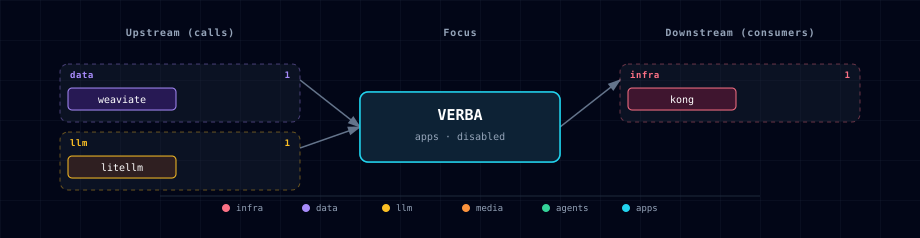

# Verba

**Track: `gen-ai-rag`**  
**Category: `apps`**  
**Default:** `VERBA_SOURCE=disabled`

## 1. Overview

Verba is Weaviate's archived Golden RAGtriever UI. Atlas includes it as an opt-in, single-user RAG demo surface over the existing Weaviate and LiteLLM services. It is useful for a sample ingest/query path that proves a user can upload content, create Verba-managed Weaviate classes such as `VERBA_Document`, and query those documents through a browser UI.

Upstream has discontinued and archived Verba. It is not a strategic maintained Atlas runtime, it does not receive upstream security fixes, and it should stay disabled unless the operator explicitly wants the reference UI.

## 2. Access

| Surface | URL | Notes |
|---|---|---|
| Kong route | `http://verba.localhost:${KONG_HTTP_PORT}` | Protected by Atlas dashboard basic-auth/ACL and available only when `VERBA_SOURCE=container`. |
| Direct port | `http://localhost:${VERBA_PORT}` | Ungated host port, intended for local development only. |
| In-network URL | `http://verba:8000` | Exported as `VERBA_ENDPOINT` for internal references. |

## 3. Configuration

| Variable | Default | Purpose |
|---|---|---|
| `VERBA_SOURCE` | `disabled` | `container` starts Verba; `disabled` scales it to zero and removes its Kong route. |
| `VERBA_IMAGE` | `semitechnologies/verba@sha256:0947d289ebff2c9814941c8d4282ee994dc79598e76162ae82e6efda4682b0b7` | Digest-pinned Docker Hub image. Upstream publishes `latest` but no matching `v2.1.3` tag. |
| `VERBA_PORT` | topology allocated | Host port for the direct UI. |
| `VERBA_WEAVIATE_URL` | auto-managed | Passed to upstream `WEAVIATE_URL_VERBA`. |
| `VERBA_OPENAI_MODEL` | empty | Optional LiteLLM model name for Verba's OpenAI generator. |
| `VERBA_OPENAI_EMBED_MODEL` | empty | Optional LiteLLM embedding model name. |
| `VERBA_DEFAULT_DEPLOYMENT` | `Docker` | Forces Verba toward external Weaviate instead of embedded local Weaviate. |

Verba receives `OPENAI_API_KEY=${LITELLM_MASTER_KEY}` plus `OPENAI_BASE_URL=http://litellm:4000/v1`, so it talks to LiteLLM rather than directly to cloud providers. Atlas also sets `OPENAI_CUSTOM_EMBED=true` because LiteLLM model names are often not OpenAI-native names.

## 4. Architecture & Wiring

Verba depends on Weaviate and LiteLLM. It stores data in Verba-managed Weaviate classes/namespaces rather than reusing Atlas backend collections. This is intentional: the ticket requires isolation, and upstream Verba's FAQ says it expects its own data shape rather than arbitrary pre-existing Weaviate data.

Docling is optional. The first Atlas slice documents Docling as the higher-quality pre-processing path for PDFs/office files, but it does not add a brittle automated bridge into Verba because Verba's public API is not advertised as a supported external ingestion API.

Open WebUI remains the primary Atlas chat surface. Verba is a reference RAG UI for inspecting Weaviate/LiteLLM behavior with a sample ingest/query workflow.

## 5. Dependencies & Integrations

### 5.1 Current — Upstream (this service calls)

| Service | Category |
|---|---|
| weaviate | data |
| litellm | llm |

### 5.2 Current — Downstream (services that call this)

| Service | Category |
|---|---|
| kong | infra |

### 5.3 Architecture diagram

[Open the interactive HTML diagram](./architecture.html) for a full-screen view.

### 5.4 Future — Missing pair integrations

_No high-confidence opportunities identified._

### 5.5 Future — Candidate new services

_No high-confidence opportunities identified._

### 5.6 Future — Unused features in this service

_No high-confidence opportunities identified._

## 6. Sample Ingest/Query

1. Enable the RAG track or explicitly start with `./start.sh --verba-source container --weaviate-source container`.
2. Open `http://verba.localhost:${KONG_HTTP_PORT}`.
3. Select Docker/custom Weaviate deployment if prompted and confirm it points at Atlas Weaviate.
4. Upload a small text/PDF sample through the Verba UI.
5. Ask a question about the uploaded content in the Verba chat view.
6. Optionally inspect Weaviate for Verba-owned classes such as `VERBA_Document`; do not mix those classes with backend/Open WebUI collections.

For higher-quality document extraction, use Docling first and paste or upload the extracted text/markdown through Verba's UI. This keeps the optional Docling path explicit without relying on unsupported Verba API internals.

## 7. Troubleshooting

| Symptom | Likely cause | Fix |
|---|---|---|
| Verba does not appear in Kong | `VERBA_SOURCE=disabled` | Set `VERBA_SOURCE=container` or pass `--verba-source container`. |
| Bootstrapper rejects the configuration | Weaviate is disabled | Enable Weaviate or keep Verba disabled. |
| Model list is empty | LiteLLM has no usable model configured | Configure an Atlas LLM provider and optionally set `VERBA_OPENAI_MODEL`. |
| Imported data collides with other RAG demos | Reusing Verba classes manually | Treat Verba classes as namespaced/internal and keep other Atlas RAG collections separate. |
