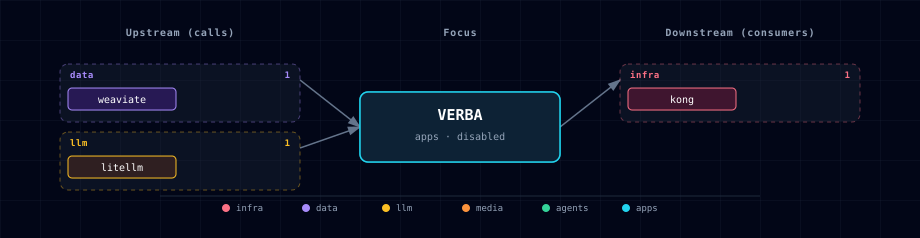

# 5.2.58. Verba

**Track: `gen-ai-rag`**  
**Category: `apps`**  
**Default:** `VERBA_SOURCE=disabled`

## 1. Overview

Verba is Weaviate's archived Golden RAGtriever UI. Atlas includes it as an opt-in, single-user RAG demo over the existing Weaviate and LiteLLM services. It gives a sample ingest/query path: upload content, let Verba create its Weaviate classes (such as `VERBA_Document`), and query the documents in a browser UI.

Upstream has discontinued and archived Verba, so it gets no upstream security fixes. Keep it disabled unless you want the reference UI.

## 2. Access

| Surface | URL | Notes |
|---|---|---|
| Kong route | `http://verba.localhost:${KONG_HTTP_PORT}` | Protected by Atlas dashboard basic-auth/ACL and available only when `VERBA_SOURCE=container`. |
| Direct port | `http://localhost:${VERBA_PORT}` | Ungated host port, intended for local development only. |
| In-network URL | `http://verba:8000` | Exported as `VERBA_ENDPOINT` for internal references. |

## 3. Configuration

| Variable | Default | Purpose |
|---|---|---|
| `VERBA_SOURCE` | `disabled` | `container` starts Verba; `disabled` scales it to zero and removes its Kong route. |
| `VERBA_IMAGE` | `semitechnologies/verba@sha256:0947d289ebff2c9814941c8d4282ee994dc79598e76162ae82e6efda4682b0b7` | Digest-pinned Docker Hub image. Upstream publishes `latest` but no matching `v2.1.3` tag. |
| `VERBA_PORT` | topology allocated | Host port for the direct UI. |
| `VERBA_WEAVIATE_URL` | auto-managed | Passed as upstream `WEAVIATE_URL_VERBA`. Verba 2.1.3 reads it only for its `Weaviate` (cloud cluster) deployment. The default `Docker` deployment always dials `weaviate:8080`. With `WEAVIATE_SOURCE=localhost`, choose `Custom` on Verba's connect screen and enter `host.docker.internal` and `WEAVIATE_LOCALHOST_PORT`. `host.docker.internal` resolves on Docker Desktop, but not by default on Linux Engine. |
| `VERBA_OPENAI_MODEL` | empty | LiteLLM chat model for Verba. Empty uses `LITELLM_DEFAULT_MODEL`. |
| `VERBA_OPENAI_EMBED_MODEL` | empty | LiteLLM embedding model. Empty uses `LITELLM_EMBEDDING_MODEL`. |
| `VERBA_DEFAULT_DEPLOYMENT` | `Docker` | Forces Verba toward external Weaviate instead of embedded local Weaviate. |

Verba receives `OPENAI_API_KEY=${LITELLM_MASTER_KEY}` and `OPENAI_BASE_URL=http://litellm:4000/v1`, so it calls LiteLLM, not cloud providers. Atlas also sets `OPENAI_CUSTOM_EMBED=true`, because LiteLLM model names are often not OpenAI names.

## 4. Architecture & Wiring

Verba depends on Weaviate and LiteLLM. It stores data in its own Weaviate classes and does not reuse Atlas backend collections. This keeps Verba's data separate; upstream expects its own data shape, not arbitrary Weaviate data.

Docling is optional: use it to pre-process PDFs and Office files. Atlas has no automated Docling-to-Verba bridge, because Verba does not support its API for external ingestion.

Open WebUI is the primary Atlas chat surface. Verba is a reference RAG UI for inspecting Weaviate and LiteLLM behaviour.

## 5. Dependencies & Integrations

### 5.1. Current — Upstream (this service calls)

| Service | Category |
|---|---|
| weaviate | data |
| litellm | llm |

### 5.2. Current — Downstream (services that call this)

| Service | Category |
|---|---|
| kong | infra |

### 5.3. Architecture diagram

[Open the full-size diagram](./architecture.html) for a full-screen view.

### 5.4. Future — Missing pair integrations

_No high-confidence opportunities identified._

### 5.5. Future — Candidate new services

_No high-confidence opportunities identified._

### 5.6. Future — Unused features in this service

_No high-confidence opportunities identified._

## 6. Sample Ingest/Query

1. Enable the RAG track or explicitly start with `./start.sh --verba-source container --weaviate-source container`.
2. Open `http://verba.localhost:${KONG_HTTP_PORT}`.
3. Select Docker/custom Weaviate deployment if prompted and confirm it points at Atlas Weaviate.
4. Upload a small text/PDF sample through the Verba UI.
5. Ask a question about the uploaded content in the Verba chat view.
6. Optionally inspect Weaviate for Verba-owned classes such as `VERBA_Document`; do not mix those classes with backend/Open WebUI collections.

For better document extraction, convert the file with Docling first, then paste or upload the extracted text or Markdown in Verba's UI.

## 7. Troubleshooting

| Symptom | Likely cause | Fix |
|---|---|---|
| Verba does not appear in Kong | `VERBA_SOURCE=disabled` | Set `VERBA_SOURCE=container` or pass `--verba-source container`. |
| Bootstrapper rejects the configuration | Weaviate is disabled | Enable Weaviate or keep Verba disabled. |
| Model list is empty | LiteLLM has no usable model configured | Check that `LITELLM_DEFAULT_MODEL` names a model LiteLLM serves, or set `VERBA_OPENAI_MODEL`. |
| Imported data collides with other RAG demos | Reusing Verba classes manually | Treat Verba classes as namespaced/internal and keep other Atlas RAG collections separate. |

## 8. Capabilities & limitations

Support tier: **experimental** — Capability contract declared; no cited cold-start, workflow, or upgrade qualification run yet (evidence at `v0.1.0`).

| Capability | Status | Verification | Notes |
|---|---|---|---|
| Reference Weaviate RAG workflow | partial | tested | Atlas wires the archived Verba UI to Weaviate and LiteLLM for isolated sample ingest and query. Atlas does not treat it as the primary maintained chat or RAG runtime. |
| Verba-managed data isolation | partial | documented | Operators are directed to Verba-owned Weaviate classes, but Atlas cannot enforce namespace separation if users manually target shared classes or cleanup operations. |
| Verba ingress authentication | partial | tested | verba.localhost is protected by Kong dashboard Basic Auth and ACL, while the host-published direct UI/API is ungated and intended only for local development. |
| Docling preprocessing integration | not-supported | documented | Docling is only a manual companion workflow because Atlas does not rely on an unsupported external Verba ingestion API. |
| Maintained secure production runtime | not-supported | documented | Upstream Verba is archived and receives no security fixes; Atlas keeps the digest-pinned reference UI disabled by default and does not certify it for production. |
| RAG service high availability | not-supported | documented | Atlas runs one Verba replica with a local data volume and configures no application failover, backup workflow, or horizontally shared UI state. |
