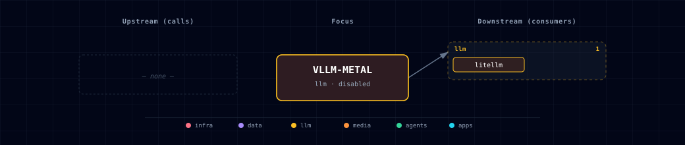

# 5.2.58. vLLM (Metal) — managed Apple-silicon LLM server

> Virtual, managed-localhost-only service (#379). There is **no container
> image**: when `VLLM_METAL_SOURCE=managed-localhost`, the Atlas bootstrapper
> installs the [`vllm-metal`](https://github.com/vllm-project/vllm-metal)
> plugin into a host Python 3.12 virtualenv and supervises a native
> `vllm serve` process on the host. Its OpenAI-compatible endpoint is
> registered with LiteLLM — every consumer (backend, Open WebUI, n8n, Hermes,
> JupyterHub) reaches the model **through the LiteLLM gateway**, never
> directly. Default is `disabled`.

## 1. Overview

Docker Desktop on macOS cannot pass the Apple GPU (Metal) into a Linux
container, so a containerized vLLM can only run on CPU — unusably slow for 7B+
models. vLLM Metal sidesteps that the same way ComfyUI's managed-MPS source
(#335) does: Atlas runs a **native host process** and containers reach it via
`host.docker.internal`.

Because vLLM already speaks the OpenAI `/v1` API, Atlas does not add a new
consumer contract. It registers the served model with LiteLLM as an
OpenAI-compatible upstream, and the rest of the stack keeps talking to LiteLLM
exactly as before. Selecting this source on any non-Apple-silicon host fails
preflight loudly rather than booting a broken upstream.

| Property | Value |
|---|---|
| Kind | Virtual manifest (no compose fragment, no Kong route, no exposed stack port) |
| Sources | `managed-localhost`, `disabled` (default `disabled`) |
| Host requirement | macOS + Apple Silicon (arm64) + Python 3.12 |
| Registered with | LiteLLM (`openai/<model>` passthrough) |
| Lifecycle owner | `bootstrapper/services/vllm_metal_manager.py` |

## 2. Access

There is no dedicated ingress. The managed process listens on
`127.0.0.1:${VLLM_METAL_LOCALHOST_PORT}` (default `8000`) on the host, and
containers reach it at `http://host.docker.internal:${VLLM_METAL_LOCALHOST_PORT}`.
Applications should call the model through LiteLLM (e.g. via the backend or
Open WebUI) using the model alias `${VLLM_METAL_MODEL}` — it appears in
LiteLLM's `/v1/models` when the source is `managed-localhost`.

Direct host probe (debugging only):

```bash
curl http://127.0.0.1:8000/v1/models
```

## 3. Configuration

All knobs live in `.env` (regenerated from `services/vllm-metal/service.yml`).

| Variable | Default | Description |
|---|---|---|
| `VLLM_METAL_SOURCE` | `disabled` | `managed-localhost` \| `disabled`. |
| `VLLM_METAL_MODEL` | `Qwen/Qwen2.5-7B-Instruct` | Hugging Face model id served and registered under the same LiteLLM alias. |
| `VLLM_METAL_LOCALHOST_PORT` | `8000` | Host port the managed OpenAI server listens on. Not a `BASE_PORT` slot. |
| `VLLM_METAL_PLUGIN_VERSION` | `0.3.0.dev20260713103604` | Atlas-verified upstream release wheel installed from GitHub with SHA-256 verification. Unverified overrides fail closed. |
| `VLLM_METAL_CORE_VERSION` | `0.24.0` | Atlas-verified vLLM core release built from its checksum-pinned source archive. It must match the supported plugin release. |
| `VLLM_METAL_PYTHON` | `python3.12` | Interpreter used to build the managed venv (vLLM Metal requires 3.12). |
| `VLLM_METAL_STATE_DIR` | `~/.atlas/vllm-metal` | Host dir holding the venv + pid/log/status files. |
| `VLLM_METAL_MODELS_PATH` | _(blank)_ | Optional Hugging Face cache dir (`HF_HOME`); blank = default HF cache. |
| `VLLM_METAL_MIN_MEMORY_GB` | `16` | Unified-memory warning floor. A lower detected value warns and an unreadable value skips the check; neither blocks install/start or guarantees model fit. |
| `VLLM_METAL_ENDPOINT` | _(auto-managed)_ | Resolved `http://host.docker.internal:<port>`; consumed by litellm-init. Blank when disabled. |
| `VLLM_METAL_SCALE` | _(auto-managed)_ | Always `0` — never a container. |

Select it non-interactively:

```bash
./start.sh --vllm-metal-source managed-localhost
```

### 3.1. Security note

The managed server binds `127.0.0.1` and runs **without an API key** (it is not
network-exposed). LiteLLM still needs a non-empty key for its OpenAI adapter, so
init.py sends a `sk-noauth` placeholder that vLLM ignores. Do not expose the
host port beyond loopback.

## 4. Lifecycle (managed host)

A normal `./start.sh` with `VLLM_METAL_SOURCE=managed-localhost` runs
preflight → install → start at the launch boundary, immediately before
`docker compose up`. If image build, Compose startup, or a required init
container fails, Atlas stops a vLLM process created by that launch; it does not
stop an instance that was already running. After the stack converges, the host
process becomes part of the running stack. The process is **host-global** —
shared by every Atlas consumer on the machine — so a project-scoped `./stop.sh`
leaves it running by default (with an advisory) rather than interrupting another
consumer; pass `./stop.sh --stop-managed-hosts` to tear it down explicitly (this
affects all consumers), or use the per-runtime `vllm-metal stop` command below.
Preflight fails on an unsupported OS/architecture, a missing Python executable,
or a detected interpreter version other than 3.12. By contrast, an unreadable Python version warns without blocking, low detected memory warns, and unreadable memory skips the check. Those advisory outcomes do not certify that the configured model fits in memory or prevent an eventual OOM.

Startup reuses an already-running managed process without comparing its served
model with a changed `VLLM_METAL_MODEL`. To change models, stop the existing process before restarting Atlas. Otherwise LiteLLM can advertise the new configured alias while the host process still serves the old model.

For explicit control (or a CI-safe, read-only preflight) use the `vllm-metal`
CLI group:

```bash
python bootstrapper/start.py vllm-metal preflight   # OS/arch/py3.12/memory/quant probe (no install)
python bootstrapper/start.py vllm-metal install      # checksum-verified core + plugin install
python bootstrapper/start.py vllm-metal start         # launch the host process (one per host)
python bootstrapper/start.py vllm-metal status        # running / pid / installed version
python bootstrapper/start.py vllm-metal health        # probe /v1/models
python bootstrapper/start.py vllm-metal stop          # stop the complete managed process group
python bootstrapper/start.py vllm-metal remove         # stop + delete the state dir
```

`atlas doctor` includes a `vllm-metal` preflight check that is `skipped` unless
the source is selected, and `fail` (with an actionable message) on an
unsupported host.

The lifecycle is intentionally structurally identical to the #335 ComfyUI
managed-MPS host so the two managed sources stay consistent: state dir + venv,
pid/log/status files, a PID-reuse stranger guard on stop, and port-in-use
refusal on start. Install compares the recorded core/plugin versions and
installed distribution metadata on every launch, rebuilding stale environments
without requiring `--update`. Stop and status operate on the whole process group so
worker subprocesses cannot survive their managed server.

## 5. Architecture & wiring

```
              ┌────────────────── host (macOS / Apple Silicon) ──────────────────┐
              │  vllm serve (native, Metal/MLX)   127.0.0.1:8000/v1               │
              └───────────────▲──────────────────────────────────────────────────┘
                              │ host.docker.internal:8000/v1  (extra_hosts: host-gateway)
   ┌──────────┐   register    │
   │ litellm  │───────────────┘  (litellm-init: vllm_metal_model_entry)
   └────▲─────┘
        │ /v1/chat/completions
   backend · open-webui · n8n · hermes · jupyterhub
```

- `bootstrapper/services/service_config.py::_generate_vllm_metal_config`
  resolves `VLLM_METAL_ENDPOINT` (docker-internal) + `VLLM_METAL_SCALE=0`.
- `services/litellm/init/scripts/init.py::vllm_metal_model_entry` appends the
  `openai/<model>` row to LiteLLM's `model_list` only when the source is
  `managed-localhost` and the endpoint resolved (blank otherwise → no row).
- `services/litellm/compose.yml` passes `VLLM_METAL_SOURCE` /
  `VLLM_METAL_ENDPOINT` / `VLLM_METAL_MODEL` to litellm-init.

## 6. Dependencies & Integrations

### 6.1. Current — Upstream (this service calls)

_No upstream calls._

### 6.2. Current — Downstream (services that call this)

| Service | Category |
|---|---|
| litellm | llm |

### 6.3. Architecture diagram



[Open the full-size diagram](./architecture.html) for a full-screen view.

### 6.4. Future — Missing pair integrations

- **vllm-metal ↔ open-webui** — *Why:* surface a per-request model picker and the served model's token/latency stats directly in the chat UI instead of only through LiteLLM's flat `/v1/models`. *Mechanism:* a small backend passthrough that reads vLLM's `/metrics` and exposes it under the existing Open WebUI admin panel. *Effort:* medium. *Confidence:* medium.
- **vllm-metal ↔ prometheus** — *Why:* vLLM exports rich Prometheus metrics (queue depth, KV-cache utilization, throughput) that would feed the stack's Grafana dashboards, but the host process isn't scraped today. *Mechanism:* a host-gateway scrape target for `127.0.0.1:<port>/metrics` when the source is active. *Effort:* medium. *Confidence:* medium.

### 6.5. Future — Candidate new services

- **MLX-LM server** — *Headline:* Apple's first-party MLX inference server is another Apple-silicon-native OpenAI-compatible option; if `vllm-metal` upstream stalls, an MLX-LM managed source could slot into the same virtual-manifest + LiteLLM-registration pattern with no consumer changes. *Status:* not assessed; revisit if the `vllm-metal` plugin's release cadence lags vLLM core.

### 6.6. Future — Unused features in this service

- **Quantized (AWQ/GPTQ/FP8) weights** — *Why pursue:* would cut memory pressure on 16 GB Macs, but the MLX/Metal backend does not yet load these cleanly (the preflight warns). Revisit when `vllm-metal` adds MLX-quant support. *Effort:* small (flip the preflight once upstream supports it).
- **Multi-model serving / LoRA adapters** — *Why pursue:* vLLM can host several models or hot-swappable LoRAs; Atlas pins a single `VLLM_METAL_MODEL` today. A managed multi-model mode would let one host process back several LiteLLM aliases. *Effort:* medium.
- **Speculative decoding / prefix caching flags** — *Why pursue:* vLLM exposes throughput knobs the managed launcher doesn't set; exposing them as env would let operators tune the host process. *Effort:* small.

## 7. Troubleshooting

**`vllm-metal preflight` fails with an OS/arch error** — this source is
Apple-silicon-only. On Intel Macs, Linux, or Windows, keep
`VLLM_METAL_SOURCE=disabled` and use a container LLM source or a cloud provider.

**Preflight reports Python version trouble** — vLLM Metal requires Python 3.12. A detected non-3.12 interpreter fails; an unreadable version produces a non-blocking warning. Point `VLLM_METAL_PYTHON` at a readable 3.12 interpreter (e.g. `brew install python@3.12`).

**Model doesn't appear in LiteLLM `/v1/models`** — confirm
`VLLM_METAL_SOURCE=managed-localhost`, then check the host process is up
(`python bootstrapper/start.py vllm-metal status`) and the endpoint resolved
(`grep VLLM_METAL_ENDPOINT .env`). litellm-init only registers the row when both
the source is managed and the endpoint is non-blank.

**First request hangs for a while** — vLLM loads weights lazily; the first
completion blocks until the model is resident. Watch progress in the log
(`~/.atlas/vllm-metal/vllm-metal.log`).

**Port already in use** — another process holds
`VLLM_METAL_LOCALHOST_PORT`. Free it or pick a different port; `start` refuses
to launch onto an occupied port.

## 8. Capabilities & limitations

| Capability | Status | Verification | Notes |
|---|---|---|---|
| Managed Apple-Silicon model serving | partial | tested | Atlas fails non-macOS/non-arm64 hosts, a missing Python interpreter, and a detected non-3.12 interpreter; an unreadable Python version warns and does not block install or start. Memory below or unreadable against VLLM_METAL_MIN_MEMORY_GB also warns or skips, does not block lifecycle, and does not certify model fit or prevent OOM. |
| Checksum-verified host runtime | supported | tested | The manager verifies the paired vLLM core archive and vllm-metal wheel, rejects unverified version overrides, and reconciles stale managed environments. |
| LiteLLM-only consumer registration | supported | tested | The selected model appears as an authenticated LiteLLM alias while the upstream stays on a loopback host port with no Kong route or stack port. |
| Single-model host lifecycle | partial | tested | One host-global process serves the model it was started with; changing VLLM_METAL_MODEL does not restart or reconcile an already-running process, so stop it before restarting Atlas or LiteLLM may advertise the new alias against the old model. Multi-model serving, LoRA adapters, project-scoped teardown, and automatic quantized-weight support are unavailable. |
| Direct upstream authentication | not-supported | tested | The loopback vLLM server has no API key and LiteLLM uses a no-auth placeholder upstream; do not bind or proxy the managed port beyond loopback. |
