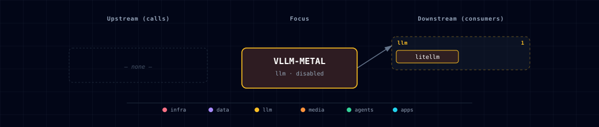

# 5.2.59. vLLM (Metal) — managed Apple-silicon LLM server

> Virtual, managed-localhost-only service. There is **no container
> image**. When `VLLM_METAL_SOURCE=managed-localhost`, the Atlas bootstrapper
> installs the [`vllm-metal`](https://github.com/vllm-project/vllm-metal)
> plugin into a host Python 3.12 virtualenv and supervises a native
> `vllm serve` process on the host. Its OpenAI-compatible endpoint is
> registered with LiteLLM. Every consumer (backend, Open WebUI, n8n, Hermes,
> JupyterHub) reaches the model **through the LiteLLM gateway**, never
> directly. Default is `disabled`.

## 1. Overview

Docker Desktop on macOS cannot pass the Apple GPU (Metal) into a Linux
container. A containerized vLLM therefore runs only on CPU, which is unusably
slow for 7B+ models. The vLLM Metal source solves this like ComfyUI's managed-MPS source:
Atlas runs a **native host process**, and containers reach it via
`host.docker.internal`.

vLLM already speaks the OpenAI `/v1` API, so Atlas adds no new consumer
contract. It registers the served model with LiteLLM as an OpenAI-compatible
upstream, and the rest of the stack keeps talking to LiteLLM. On any host that
is not Apple Silicon, this source fails preflight instead of booting a broken
upstream.

| Property | Value |
|---|---|
| Kind | Virtual manifest (no compose fragment, no Kong route, no exposed stack port) |
| Sources | `managed-localhost`, `disabled` (default `disabled`) |
| Host requirement | macOS + Apple Silicon (arm64) + Python 3.12 |
| Registered with | LiteLLM (`openai/<model>` passthrough) |
| Lifecycle owner | `bootstrapper/services/vllm_metal_manager.py` |

## 2. Access

There is no dedicated ingress. The managed process listens on
`127.0.0.1:${VLLM_METAL_LOCALHOST_PORT}` (default `8000`) on the host, and
containers reach it at `http://host.docker.internal:${VLLM_METAL_LOCALHOST_PORT}`.
Call the model through LiteLLM (for example via the backend or Open WebUI)
with the model alias `${VLLM_METAL_MODEL}`. The alias appears in LiteLLM's
`/v1/models` when the source is `managed-localhost`.

Direct host probe (debugging only):

```bash
curl http://127.0.0.1:8000/v1/models
```

## 3. Configuration

All knobs live in `.env` (regenerated from `services/vllm-metal/service.yml`).

| Variable | Default | Description |
|---|---|---|
| `VLLM_METAL_SOURCE` | `disabled` | `managed-localhost` \| `disabled`. |
| `VLLM_METAL_MODEL` | `Qwen/Qwen2.5-7B-Instruct` | Hugging Face model id served and registered under the same LiteLLM alias. |
| `VLLM_METAL_LOCALHOST_PORT` | `8000` | Host port the managed OpenAI server listens on. Not a `BASE_PORT` slot. A change restarts an Atlas-owned server on the new port at the next start. |
| `VLLM_METAL_PLUGIN_VERSION` | `0.3.0.dev20260713103604` | Atlas-verified upstream release wheel installed from GitHub with SHA-256 verification. Unverified overrides fail closed. |
| `VLLM_METAL_CORE_VERSION` | `0.24.0` | Atlas-verified vLLM core release built from its checksum-pinned source archive. It must match the supported plugin release. |
| `VLLM_METAL_PYTHON` | `python3.12` | Interpreter used to build the managed venv (vLLM Metal requires 3.12). |
| `VLLM_METAL_STATE_DIR` | `~/.atlas/vllm-metal` | Host dir holding the venv + pid/log/status files. A blank value uses the default. `./start.sh vllm-metal remove` refuses a dir that is, or is a parent of, the working directory, the repository, `$HOME` or the `~/.atlas` state root (`ATLAS_MANAGED_HOST_STATE_ROOT`). It compares file identity, so another spelling is refused too. |
| `VLLM_METAL_MODELS_PATH` | _(blank)_ | Optional Hugging Face cache dir (`HF_HOME`); blank = default HF cache. `./start.sh vllm-metal remove` refuses to delete a state dir that contains this path. |
| `VLLM_METAL_MIN_MEMORY_GB` | `16` | Unified-memory warning floor. A lower detected value warns and an unreadable value skips the check; neither blocks install/start or guarantees model fit. A value that is not a whole number (for example `15.5`) stops a launch with an error. `stop`, `status` and `remove` then use `16`. |
| `VLLM_METAL_ENDPOINT` | _(auto-managed)_ | Resolved `http://host.docker.internal:<port>`; consumed by litellm-init. Blank when disabled. |
| `VLLM_METAL_SCALE` | _(auto-managed)_ | Always `0` — never a container. |

Select it non-interactively:

```bash
./start.sh --vllm-metal-source managed-localhost
```

### 3.1. Security note

The managed server binds `127.0.0.1` and runs **without an API key** (it is not
network-exposed). LiteLLM still needs a non-empty key for its OpenAI adapter, so
init.py sends a `sk-noauth` placeholder that vLLM ignores. Do not expose the
host port beyond loopback.

## 4. Lifecycle (managed host)

A normal `./start.sh` with `VLLM_METAL_SOURCE=managed-localhost` runs
preflight → install → start immediately before `docker compose up`. The shared
managed-host rules apply: rollback on a failed launch, a host-global process,
and opt-in stop with `./stop.sh --stop-managed-hosts`. See
[Operations §8](../../docs/operations/index.md#8-managed-host-lifecycle) and the
[ComfyUI managed-MPS lifecycle](../comfyui/README.md#92-lifecycle), which uses
the same framework. vLLM-specific points:

- A read-only check runs before a warm start stops the stack. If the host
  would refuse to start, the launch exits and leaves the running containers as
  they are.
- A plain `./stop.sh` leaves the process running and prints an advisory. To
  stop only vLLM, run `./start.sh vllm-metal stop`.
- Preflight fails on an unsupported OS or architecture, a missing Python
  executable, or a detected interpreter other than 3.12.
- By contrast, an unreadable Python version warns without blocking. Low
  detected memory warns, and unreadable memory skips the check. These outcomes do not certify
  that the model fits in memory or prevent an out-of-memory failure.

Startup reuses a running managed process when its port and listen address
match. It does not compare the served model with a changed `VLLM_METAL_MODEL`.
To change models, stop the existing process before restarting Atlas: run
`./start.sh vllm-metal stop`, then `./start.sh`.
Otherwise LiteLLM can advertise the new alias while the host process still
serves the old model.

For explicit control, or a CI-safe read-only preflight, use the `vllm-metal`
CLI group:

```bash
./start.sh vllm-metal preflight   # OS/arch/py3.12/memory/quant probe (no install)
./start.sh vllm-metal install      # checksum-verified core + plugin install
./start.sh vllm-metal start         # launch the host process (one per host)
./start.sh vllm-metal status        # running / pid / installed version
./start.sh vllm-metal health        # probe /v1/models
./start.sh vllm-metal stop          # stop the complete managed process group
./start.sh vllm-metal remove         # stop + delete the state dir
```

`./start.sh doctor` includes a `vllm-metal` preflight check. It is `skipped`
unless the source is selected, and `fail` (with an actionable message) on an
unsupported host.

Before each new launch, install compares the recorded core and plugin versions
and the installed distribution metadata. It rebuilds a stale environment
without `--update`. Stop and status act on the whole process group, so worker
subprocesses cannot survive their server.

## 5. Architecture & wiring

```
              ┌────────────────── host (macOS / Apple Silicon) ──────────────────┐
              │  vllm serve (native, Metal/MLX)   127.0.0.1:8000/v1               │
              └───────────────▲──────────────────────────────────────────────────┘
                              │ host.docker.internal:8000/v1  (extra_hosts: host-gateway)
   ┌──────────┐   register    │
   │ litellm  │───────────────┘  (litellm-init: vllm_metal_model_entry)
   └────▲─────┘
        │ /v1/chat/completions
   backend · open-webui · n8n · hermes · jupyterhub
```

- `bootstrapper/services/service_config.py::_generate_vllm_metal_config`
  resolves `VLLM_METAL_ENDPOINT` (docker-internal) + `VLLM_METAL_SCALE=0`.
- `services/litellm/init/scripts/init.py::vllm_metal_model_entry` appends the
  `openai/<model>` row to LiteLLM's `model_list` only when the source is
  `managed-localhost` and the endpoint resolved (blank otherwise → no row).
- `services/litellm/compose.yml` passes `VLLM_METAL_SOURCE` /
  `VLLM_METAL_ENDPOINT` / `VLLM_METAL_MODEL` to litellm-init.

## 6. Dependencies & Integrations

### 6.1. Current — Upstream (this service calls)

_No upstream calls._

### 6.2. Current — Downstream (services that call this)

| Service | Category |
|---|---|
| litellm | llm |

### 6.3. Architecture diagram



[Open the full-size diagram](./architecture.html) for a full-screen view.

### 6.4. Future — Missing pair integrations

- **vllm-metal ↔ open-webui** — *Why:* show a per-request model picker and the served model's token and latency stats in the chat UI. Today only LiteLLM's flat `/v1/models` shows the model. *Mechanism:* a small backend passthrough reads vLLM's `/metrics` and exposes it in the Open WebUI admin panel. *Effort:* medium. *Confidence:* medium.
- **vllm-metal ↔ prometheus** — *Why:* vLLM exports Prometheus metrics (queue depth, KV-cache utilization, throughput) for the Grafana dashboards. Nothing scrapes the host process. *Mechanism:* a host-gateway scrape target for `127.0.0.1:<port>/metrics` when the source is active. *Effort:* medium. *Confidence:* medium.

### 6.5. Future — Candidate new services

- **MLX-LM server** — *Headline:* Apple's first-party MLX inference server is another Apple-silicon-native OpenAI-compatible option. If `vllm-metal` upstream stalls, an MLX-LM managed source can use the same virtual-manifest and LiteLLM-registration pattern with no consumer changes. *Status:* not assessed; revisit if the `vllm-metal` plugin's releases lag vLLM core.

### 6.6. Future — Unused features in this service

- **Quantized (AWQ/GPTQ/FP8) weights** — *Why pursue:* they would cut memory pressure on 16 GB Macs. The MLX/Metal backend does not yet load them cleanly (the preflight warns). Revisit when `vllm-metal` adds MLX-quant support. *Effort:* small (flip the preflight once upstream supports it).
- **Multi-model serving / LoRA adapters** — *Why pursue:* vLLM can host several models or hot-swappable LoRAs; Atlas pins a single `VLLM_METAL_MODEL`. A managed multi-model mode would let one host process back several LiteLLM aliases. *Effort:* medium.
- **Speculative decoding / prefix caching flags** — *Why pursue:* the managed launcher does not set these vLLM throughput knobs. Env settings for them would let operators tune the host process. *Effort:* small.

## 7. Troubleshooting

**`vllm-metal preflight` fails with an OS/arch error** — this source is
Apple-silicon-only. On Intel Macs, Linux, or Windows, keep
`VLLM_METAL_SOURCE=disabled` and use a container LLM source or a cloud provider.

**Preflight reports Python version trouble** — vLLM Metal requires Python 3.12. A detected non-3.12 interpreter fails; an unreadable version produces a non-blocking warning. Point `VLLM_METAL_PYTHON` at a readable 3.12 interpreter (e.g. `brew install python@3.12`).

**Model doesn't appear in LiteLLM `/v1/models`** — confirm
`VLLM_METAL_SOURCE=managed-localhost`. Then check that the host process is up
(`./start.sh vllm-metal status`) and that the endpoint resolved
(`grep VLLM_METAL_ENDPOINT .env`). The litellm-init container registers the row only when
the source is managed and the endpoint is non-blank.

**Start warns `still loading weights`** — `./start.sh` waits up to 120 s for
`/v1/models`. A first weight download or a large model takes longer; start then
warns and continues. Requests to the model fail or wait until the server is
ready. Watch progress in `${VLLM_METAL_STATE_DIR}/vllm-metal.log` (default
`~/.atlas/vllm-metal/vllm-metal.log`).

**Port already in use** — another process holds
`VLLM_METAL_LOCALHOST_PORT`. Free it or pick a different port; `start` refuses
to launch onto an occupied port.

**"has no start_utc identity stamp" after a pin bump** — an older Atlas wrote
the pid file. Atlas cannot prove it launched the live process, so it does not
signal it. The bring-up warns and continues, and leaves that process running.
Confirm that the pid is the old vLLM host. Then run the `kill -TERM <pid>` and
`rm -f <pid file>` commands that the warning prints, and re-run `./start.sh`.

**Doctor warns the pid "now belongs to a different, younger process"** — the
OS recycled the pid after the recorded process exited. The record is stale; the
next start replaces it and never signals that process.

## 8. Capabilities & limitations

Support tier: **experimental** — Capability contract declared; no cited cold-start, workflow, or upgrade qualification run yet (evidence at `v0.1.0`).

| Capability | Status | Verification | Notes |
|---|---|---|---|
| Managed Apple-Silicon model serving | partial | tested | Atlas fails non-macOS/non-arm64 hosts, a missing Python interpreter, and a detected non-3.12 interpreter; an unreadable Python version warns and does not block install or start. Memory below or unreadable against VLLM_METAL_MIN_MEMORY_GB also warns or skips, does not block lifecycle, and does not certify model fit or prevent OOM. |
| Checksum-verified host runtime | supported | tested | The manager verifies the paired vLLM core archive and vllm-metal wheel, rejects unverified version overrides, and reconciles stale managed environments. |
| LiteLLM-only consumer registration | supported | tested | The selected model appears as an authenticated LiteLLM alias while the upstream stays on a loopback host port with no Kong route or stack port. |
| Single-model host lifecycle | partial | tested | One host-global process serves the model it was started with. Changing VLLM_METAL_MODEL does not restart or reconcile an already-running process, so stop it before restarting Atlas. Otherwise LiteLLM may advertise the new alias against the old model. Multi-model serving, LoRA adapters, project-scoped teardown and automatic quantized-weight support are unavailable. |
| Direct upstream authentication | not-supported | tested | The loopback vLLM server has no API key and LiteLLM uses a no-auth placeholder upstream; do not bind or proxy the managed port beyond loopback. |
