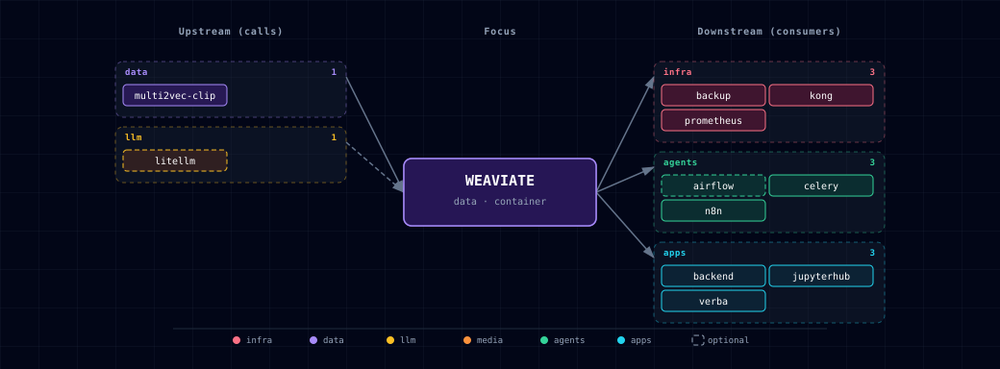

# 5.2.60. Weaviate

**Port:** `WEAVIATE_PORT` (REST, default 63030) / `WEAVIATE_GRPC_PORT` (gRPC, default 63031)
**SOURCE variable:** `WEAVIATE_SOURCE`
**SOURCE options:** container, localhost, disabled

## 1. Overview

Vector database used for semantic search, RAG, embeddings, n8n workflows, Backend features, and notebooks. It is enabled by default (`WEAVIATE_SOURCE=container`), together with the `multi2vec-clip` image vectorizer.

## 2. Access

| Path | URL | Notes |
|---|---|---|
| Direct | `http://localhost:${WEAVIATE_PORT}` (REST) / `localhost:${WEAVIATE_GRPC_PORT}` (gRPC) | Container mode only. |
| Kong | `http://weaviate.localhost:${KONG_HTTP_PORT}` | Requires `./start.sh --setup-hosts`. |
| Internal | `http://weaviate:8080` (REST) / `weaviate:50051` (gRPC) | Backend network; consumers read `WEAVIATE_URL`. |

Anonymous access is on, so only the Kong origin may call Weaviate from a browser: `CORS_ALLOW_ORIGIN=http://weaviate.localhost:${KONG_HTTP_PORT}`. Server-side clients are unaffected.

See the canonical port table at [Ports and Routes](../../docs/reference/ports-routes.md).

## 3. Configuration

```bash
WEAVIATE_SOURCE=container          # container | localhost | disabled
WEAVIATE_LOCALHOST_PORT=8080       # host port when WEAVIATE_SOURCE=localhost
# WEAVIATE_URL is auto-managed: http://weaviate:8080, http://host.docker.internal:<port>, or empty
```

Scripted changes: `./start.sh --weaviate-source <value>` and `--multi2vec-clip-source <value>`.

### 3.1. Vectorization through LiteLLM

Text vectorization goes through the always-on **LiteLLM gateway** via the `text2vec-openai` module. Weaviate receives only `OPENAI_APIKEY`, set to `LITELLM_MASTER_KEY`. Whoever creates a collection (the Backend or a consumer) sets the LiteLLM base URL in `moduleConfig.text2vec-openai.baseURL`. Without it, `text2vec-openai` calls api.openai.com.

Weaviate uses whatever embedding model LiteLLM serves: Ollama `nomic-embed-text` by default, or a cloud model. No separate `text2vec-ollama` wiring is needed. The default vectorizer is `none`. Each collection must name its vectorizer and `baseURL`, or supply its own vectors. Otherwise a `text2vec-openai` default would send the master key to api.openai.com. To add embedding models, see [LiteLLM Gateway](../litellm/README.md).

### 3.2. Multi2Vec CLIP module

The default stack keeps the multimodal CLIP vectorizer enabled:

```bash
MULTI2VEC_CLIP_SOURCE=container-cpu
WEAVIATE_ENABLE_MODULES=text2vec-openai,text2vec-ollama,multi2vec-clip,generative-openai,generative-ollama,backup-filesystem
CLIP_INFERENCE_API=http://multi2vec-clip:8080
MULTI2VEC_CLIP_SIGLIP2_IMAGE=semitechnologies/multi2vec-clip:google-siglip2-so400m-patch16-512-1.5.1
```

With `MULTI2VEC_CLIP_SOURCE=disabled` the bootstrapper drops `multi2vec-clip` from `WEAVIATE_ENABLE_MODULES` and blanks `CLIP_INFERENCE_API` itself; the resulting values are:

```bash
MULTI2VEC_CLIP_SOURCE=disabled
WEAVIATE_ENABLE_MODULES=text2vec-openai,text2vec-ollama,generative-openai,generative-ollama,backup-filesystem
CLIP_INFERENCE_API=
```

SigLIP 2 is opt-in. The default ViT-B/32 image emits 512-d vectors; `MULTI2VEC_CLIP_SIGLIP2_IMAGE` emits 1152-d vectors. Do not change `MULTI2VEC_CLIP_IMAGE` for existing collections until you recreate or revectorize them. Keep `CLIP_INFERENCE_API=http://multi2vec-clip:8080`. The SigLIP 2 image is much larger than the default. `MULTI2VEC_CLIP_SOURCE=container-gpu` currently requests no GPU device (open issue #1373), so it runs on CPU.

### 3.3. Persistence, backup and restore

In container mode, collections persist in the `${PROJECT_NAME}-weaviate-data` volume. Native snapshots from the `backup-filesystem` module go to the `${PROJECT_NAME}-weaviate-backups` volume at `/var/lib/weaviate/backups`. `./stop.sh --cold` removes both volumes.

The backup service owns backup and restore. `services/backup/run-consistent-backup.sh` takes a native snapshot while Weaviate stays online. `services/backup/run-database-restore.sh` restores Neo4j and Weaviate together into fresh volumes, validates them, then replaces the live data. It requires `BACKUP_RESTORE_MAINTENANCE_MODE=confirmed` and stopped writers. The [backup README](../backup/README.md) has the full procedure. In `localhost` mode, use the host installation's own backup tools.

## 4. Integration notes

Consumers are listed in §5.2. Open WebUI is not wired to Weaviate.

Optional consumers should read `WEAVIATE_URL` and check readiness at the feature level instead of declaring a hard Compose dependency. JupyterHub and the Backend still start when Weaviate is disabled or host-run. n8n is the exception. It requires Weaviate, so `WEAVIATE_SOURCE=disabled` also disables n8n and n8n-worker.

## 5. Dependencies & Integrations

### 5.1. Current — Upstream (this service calls)

| Service | Category | Status |
|---|---|---|
| multi2vec-clip | data | current |
| litellm | llm | optional: only collections whose text2vec-openai baseURL is LiteLLM, as the backend's are |

### 5.2. Current — Downstream (services that call this)

| Service | Category | Status |
|---|---|---|
| backup | infra | current |
| kong | infra | current |
| prometheus | infra | current |
| airflow | agents | optional: an operator-authored DAG; airflow-init only seeds the Connection |
| celery | agents | current |
| n8n | agents | current |
| backend | apps | current |
| jupyterhub | apps | current |
| verba | apps | current |

### 5.3. Architecture diagram



[Open the full-size diagram](./architecture.html) for a full-screen view.

### 5.4. Future — Missing pair integrations

- **weaviate ↔ doc-processor** — *Why:* closes the RAG loop. Docling already extracts structured text + tables from PDFs; today nothing routes that output into Weaviate, so n8n/backend re-implement chunking ad hoc. *Mechanism:* n8n flow or backend route reads docling JSON, chunks, then `POST /v1/batch/objects` into a `Document` collection vectorized via `text2vec-openai`. *Effort:* medium. *Confidence:* high.
- **weaviate ↔ n8n** — *Why:* n8n already receives `WEAVIATE_URL` and requires Weaviate. No shipped example workflow uses n8n's Weaviate node to ingest webhook payloads, search, and feed retrieval into the AI Agent nodes. *Mechanism:* seed an example workflow driving the n8n Weaviate node → `http://weaviate:8080` (REST) or gRPC on `:50051`. *Effort:* small. *Confidence:* high.
- **weaviate ↔ hermes** — *Why:* Hermes has no long-term memory or retrieval tool. A Weaviate-backed memory skill lets Hermes recall past sessions, store tool outputs, and do semantic lookup over user docs. *Mechanism:* Hermes custom skill posts/queries via the Weaviate Python client to `http://weaviate:8080` with hybrid search; collection seeded by `weaviate-init`. *Effort:* medium. *Confidence:* medium.
- **weaviate ↔ comfyui** — *Why:* ComfyUI generates images but they're write-only artifacts on disk. CLIP-vectorizing them into Weaviate enables similarity search over the user's own generation history ("more like this"). *Mechanism:* ComfyUI custom node or n8n post-execution hook → `POST /v1/objects` to a `Generation` collection vectorized by `multi2vec-clip` (already enabled). *Effort:* medium. *Confidence:* medium.

### 5.5. Future — Candidate new services

_No high-confidence opportunities identified._

### 5.6. Future — Unused features in this service

- **`backup-s3` module** — *Why pursue:* the current single-node filesystem module is exported by the backup runner; direct S3 backup would support a future multi-node Weaviate deployment. *Effort:* small.
- **Named vectors (`vectorConfig` array)** — *Why pursue:* one collection could carry both a text2vec-openai vector and a multi2vec-clip vector, for hybrid text+image search without two collections. *Effort:* medium.
- **Reranker modules (`reranker-transformers` or `reranker-cohere`)** — *Why pursue:* cheap quality lift on RAG queries; the transformers variant runs in-cluster with no extra API costs. *Effort:* medium.
- **Multi-tenancy (per-collection tenant shards)** — *Why pursue:* backend/n8n/Hermes could share one Weaviate cluster with per-user isolation instead of single-tenant anonymous access. *Effort:* medium.
- **Generative modules beyond OpenAI/Ollama** — *Why pursue:* LiteLLM already fronts Anthropic/Cohere; matching Weaviate's generative module list (`generative-anthropic`, `generative-cohere`) widens GraphQL-side RAG options. *Effort:* small.

## 6. Troubleshooting

Run the `docker compose` commands from the repository root. Add `-p "$PROJECT_NAME"` if the checkout directory name differs from `PROJECT_NAME`.

```bash
# Check the three containers: weaviate-init must exit 0 before weaviate starts
docker compose ps -a weaviate-init weaviate multi2vec-clip
docker compose logs weaviate-init weaviate

# Readiness from the host (container mode)
curl -fsS http://localhost:${WEAVIATE_PORT}/v1/.well-known/ready
```

- **Vectorization calls api.openai.com or fails with an OpenAI auth error** — the collection has no `moduleConfig.text2vec-openai.baseURL`. Recreate it with the LiteLLM base URL (§3.1).
- **n8n is missing after you disable Weaviate** — expected; `WEAVIATE_SOURCE=disabled` also disables n8n and n8n-worker (§4).
- **`multi2vec-clip` vectors have the wrong dimension** — the CLIP image changed under an existing collection. Recreate or revectorize the collection (§3.2).

For general startup and routing issues, see [Troubleshooting](../../docs/quick-start/troubleshooting.md).

## 7. Capabilities & limitations

Support tier: **experimental** — Capability contract declared; no cited cold-start, workflow, or upgrade qualification run yet (evidence at `v0.1.0`).

| Capability | Status | Verification | Notes |
|---|---|---|---|
| Persistent semantic vector storage | supported | tested | Atlas configures persistent Weaviate REST and gRPC storage. It wires backend consumers through container or operator-run localhost sources. Backend memory vectorizes through the in-network LiteLLM, so a localhost Weaviate leaves memory on pgvector. |
| LiteLLM and CLIP vectorization | partial | tested | Text vectorization routes through LiteLLM and optional CLIP supports multimodal embeddings, but enabling SigLIP changes dimensions and requires collection revectorization. |
| Authenticated multi-tenant isolation | not-supported | documented | The stock container enables anonymous access and Atlas does not provision tenant boundaries or per-consumer authorization policies. |
| Automated vector database backups | supported | tested | Atlas enables Weaviate's native filesystem backup provider and the backup runner creates, polls, verifies, exports, and restores completed snapshots without archiving the live data volume. Scheduling and retention remain operator-owned. |
