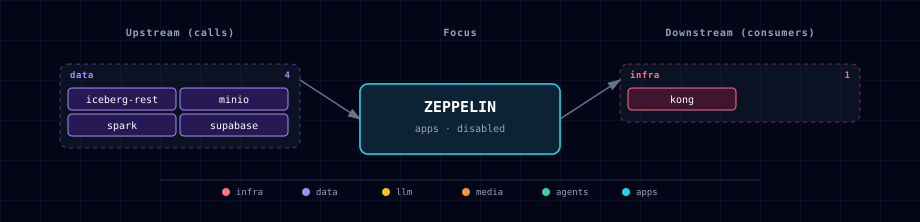

# Apache Zeppelin (Spark-first notebook)

Zeppelin runs as a single container in the stack's `apps` band. The Spark interpreter is intended for the in-stack standalone Spark cluster (`spark://spark-master:7077`) plus MinIO S3A. The JDBC interpreter ships with credentials in env vars but Zeppelin does not auto-load them — first-time users create a `postgres` interpreter (group `jdbc`) via the UI — `default.url` = `${ZEPPELIN_JDBC_POSTGRES_URL}`; see §4 for the one-time setup. Notebooks live in `services/zeppelin/notebooks/`, bind-mounted into the container.

## 1. Overview

Image: `apache/zeppelin:0.12.1` (Apache 2.0), wrapped by `services/zeppelin/build/Dockerfile` so `/opt/spark` contains the matching Spark 4.1.2 runtime plus S3A and Iceberg lakehouse jars. All interpreters run in-process (no Kubernetes interpreter isolation). The Spark interpreter is the headline.

**Hard requirement:** Zeppelin is gated on `SPARK_SOURCE != disabled`. Picking `ZEPPELIN_SOURCE=container` without Spark surfaces an actionable error from the bootstrapper; the spec considers a Spark-less Zeppelin broken on purpose.

**Design update:** [Zeppelin Backend Decision](../../docs/strategy/zeppelin-spark-backend-decision.md) selects the standalone Spark interpreter path for Atlas Zeppelin. Spark Connect remains supported by JupyterHub and other Spark Connect clients. The stack should not require `%spark` Scala to use Spark Connect because Zeppelin's stock interpreter launches through `spark-submit` and Spark 4 rejects `spark.remote` mixed with master/deploy-mode configuration.

### 1.1 Spark backend posture

Atlas should treat Zeppelin as a Spark-submit/standalone Spark notebook surface:

- The selected backend is `spark.master=spark://spark-master:7077`.
- The implementation path for zero-touch lakehouse notebooks is a bundled or mounted `SPARK_HOME` plus seeded interpreter settings for MinIO S3A and the Iceberg REST `lakehouse` catalog.
- JupyterHub remains the Spark Connect notebook path for Python and Scala clients that use `SPARK_REMOTE`, `SparkSession.builder.remote(...)`, or Spark Connect client libraries directly.

The stack should not configure Spark Connect's remote property as the happy path for Zeppelin `%spark` on Spark 4.

### 1.2 Zero-touch Spark interpreter seeding

`zeppelin-init` waits for the Zeppelin REST API, updates the stock `spark` interpreter setting, restarts it, and exits. It is idempotent: rerunning it preserves user-owned properties while overwriting Atlas-owned Spark/lakehouse values.

Seeded values include:

- `SPARK_HOME=/opt/spark`
- `spark.master=spark://spark-master:7077`
- `zeppelin.spark.enableSupportedVersionCheck=false`
- `spark.submit.deployMode=client`
- `spark.driver.host=zeppelin` and `spark.driver.bindAddress=0.0.0.0`
- MinIO S3A settings for `s3a://` reads/writes and Spark event logs
- Iceberg REST catalog settings for `lakehouse` at `http://iceberg-rest:8181`

Manual recovery path: open Zeppelin (`http://localhost:${ZEPPELIN_PORT}` or `http://zeppelin.localhost:${KONG_HTTP_PORT}`), go to top-right user menu → **Interpreter** → `spark`, and verify the values above. Click **Save**, then confirm the restart prompt if you make changes.

### 1.3 Verify it works

In a new notebook, run a `%spark` (Scala) cell:

```scala
%spark
println(spark.version)                 // prints the cluster's Spark version (4.1.x)
spark.range(5).selectExpr("id * id as sq").show()
```

…and a `%spark.pyspark` (Python) cell:

```python
%spark.pyspark
spark.sql("SELECT 1 + 1 AS result").show()
```

If both return values, the notebook is talking to the standalone Spark cluster. (The starter notebook `notebooks/spark_basics.zpln` in §5 does the same checks plus an s3a round-trip.)

With Iceberg REST enabled, a `%spark.sql` cell can validate the lakehouse catalog:

```sql
%spark.sql
SHOW NAMESPACES IN lakehouse
```

### 1.4 How MinIO (s3a) and Spark History work

For the intended zero-touch path, users should not configure storage credentials in the notebook. The seeded Spark interpreter should carry the same storage settings as the rest of the lakehouse stack:

- `s3a://` reads/writes use `spark.hadoop.fs.s3a.*` settings for MinIO endpoint `http://minio:9000`, credentials, and path-style addressing.
- `spark.eventLog.enabled=true` + `spark.eventLog.dir=s3a://spark-history/` send events to the Spark History Server automatically. Browse them at the Spark History UI (`SPARK_HISTORY_PORT`).
- Iceberg SQL should use `spark.sql.catalog.lakehouse.*` settings pointed at `http://iceberg-rest:8181` and the `s3a://lakehouse/` warehouse.

### 1.5 Reaching Spark Connect from outside the stack (host IDEs, remote/cloud)

The `spark-connect` sidecar is **backend-only by design** — it publishes no host port, so `sc://spark-connect:15002` resolves only from inside the Docker `backend-network` for clients that actually use Spark Connect. JupyterHub is the in-stack notebook surface for that protocol. Two ways to go further, both tracked as roadmap items:

- **Host-side IDE / local Jupyter:** would require publishing the 15002 gRPC port to the host (then `sc://localhost:<port>`). Not enabled in the in-stack-only baseline.
- **Remote/managed Spark (cloud burst):** the same `spark.remote` client can point at a managed Spark Connect endpoint instead. Amazon EMR Serverless, for example, exposes interactive Spark Connect sessions at `sc://<endpoint>:443/;use_ssl=true;x-aws-proxy-auth=<token>` — the token is fetched per-session via the `emr-serverless` API and expires hourly, and the client's Spark version must match the EMR release's Spark version. That is a fundamentally different, ephemeral-session + IAM model than the static in-network sidecar — useful for scale-out, not a drop-in replacement.

### 1.6 Driving Zeppelin from VS Code

Zeppelin speaks its own REST + websocket protocol, **not** the Jupyter kernel protocol — so VS Code's built-in Jupyter extension cannot connect to it. Use the community **"Zeppelin Notebook"** extension ([`AllenLi1231.zeppelin-vscode`](https://marketplace.visualstudio.com/items?itemName=AllenLi1231.zeppelin-vscode)) instead. It renders `.zpln` notebooks in VS Code and runs every paragraph **server-side** on the Zeppelin server:

1. Install `AllenLi1231.zeppelin-vscode` from the Marketplace (requires Zeppelin >= 0.8.0; this image is 0.12.1).
2. Open or create a `.zpln` file. On the first cell run, the extension prompts for the **server URL** — enter `http://localhost:${ZEPPELIN_PORT}` (no credentials; the stack ships no auth — see §2).
3. Confirm `zeppelin-init` has completed successfully if the Spark interpreter is not ready yet. The setting lives server-side, so it applies to the web UI and VS Code alike.

Because execution happens on the server, `%spark` (Scala) and `%spark.pyspark` cells use the same Zeppelin-side Spark interpreter as the web UI — VS Code never needs a Scala kernel or a Spark client of its own, and S3A/MinIO + the History Server behave identically.

**Remote host:** the extension only needs the HTTP UI, so SSH-tunnel it and point at localhost — `ssh -N -L ${ZEPPELIN_PORT}:localhost:${ZEPPELIN_PORT} user@host`. You do **not** expose Spark RPC or backend-only Spark Connect ports.

**Caveats** (third-party extension): no notebook permissions / version-control / cron; don't edit a cell mid-run (close and reopen the notebook to resync); the VS Code language mode is cosmetic syntax highlighting only. The browser UI (§2) is the dependable fallback.

## 2. Access

| Surface | URL | Auth |
|---|---|---|
| Direct | `http://localhost:${ZEPPELIN_PORT}` | None |
| Kong | `http://zeppelin.localhost:${KONG_HTTP_PORT}` | None |

No authentication ships pre-configured. For real use, enable Shiro auth via `conf/shiro.ini` (see [Zeppelin upstream docs](https://zeppelin.apache.org/docs/0.12.0/setup/security/shiro_authentication.html)).

## 3. Configuration

```bash
ZEPPELIN_SOURCE=disabled           # container | disabled
ZEPPELIN_IMAGE=apache/zeppelin:0.12.1
ZEPPELIN_INIT_IMAGE=python:3.12-alpine
ZEPPELIN_PORT=                     # auto-assigned (apps band)
```

## 4. Integration with the stack

- **Spark** (required) — `%spark` cells use the standalone Spark interpreter path selected in the Zeppelin backend decision: `SPARK_HOME` plus `spark.master=spark://spark-master:7077`.
- **MinIO** — `s3a://` credentials come from the seeded Spark interpreter/Spark submit configuration.
- **Iceberg REST** (optional) — when `ICEBERG_REST_SOURCE=container`, the seeded `lakehouse` catalog points to `http://iceberg-rest:8181` and uses the scoped Iceberg MinIO credentials for S3FileIO.
- **Supabase Postgres** — JDBC connection details exposed as env vars (`ZEPPELIN_JDBC_POSTGRES_URL` / `_USER` / `_PASSWORD`). Zeppelin does not auto-bind these to the JDBC interpreter — one-time setup: open Zeppelin → Interpreter → `+ Create`, name it `postgres` with interpreter group `jdbc`, and set `default.driver=org.postgresql.Driver`, `default.url=jdbc:postgresql://supabase-db:5432/${SUPABASE_DB_NAME}` (copy the exact value from the container's `ZEPPELIN_JDBC_POSTGRES_URL` env — `${SUPABASE_DB_NAME}` defaults to `postgres` but is configurable), `default.user`/`default.password` from the corresponding env vars. Then `%postgres SELECT version()` works — note the old `%jdbc(postgres)` prefix syntax was removed in Zeppelin 0.12 (the interpreter warns "not supported anymore" and falls back to `default.*`). Tracked as a future improvement (bind-mount `conf/interpreter.json` so this is zero-touch).
- **LiteLLM** (optional) — Python interpreter can call the LiteLLM gateway via `openai.OpenAI(base_url="http://litellm:4000/v1", api_key=...)`. No pre-configuration ships; users wire it themselves.

## 5. Starter notebook

`services/zeppelin/notebooks/spark_basics.zpln` ships pre-loaded. 4 cells:
1. Spark version check (`sc.version`)
2. Markdown intro
3. MinIO round-trip via S3A (`s3a://spark-history/...`)
4. Postgres JDBC `SELECT version()` against supabase-db (requires the one-time `postgres` interpreter setup in §4; the cell will error with "Interpreter not properly configured" until you complete it)

Use it as a template for your own notebooks.

## 6. Dependencies & Integrations

> Auto-generated section — the **Current** subsections are derived from `services/zeppelin/service.yml`'s `data_flow.calls` field (and inverse passes). Re-run `python -m bootstrapper.docs.regen zeppelin` after manifest changes.

### 6.1 Current — Upstream (this service calls)

| Service | Category |
|---|---|
| iceberg-rest | data |
| minio | data |
| spark | data |
| supabase | data |

### 6.2 Current — Downstream (services that call this)

| Service | Category |
|---|---|
| kong | infra |

### 6.3 Architecture diagram



[Open the interactive HTML diagram](./architecture.html) for a full-screen view.

### 6.4 Future — Missing pair integrations

_No high-confidence opportunities identified._

### 6.5 Future — Candidate new services

_No high-confidence opportunities identified._

### 6.6 Future — Unused features in this service

_No high-confidence opportunities identified._

## 7. Troubleshooting

- **Spark interpreter says "no master URL"** — `SPARK_MASTER` env var is missing from the container. Check the compose env block; the manifest's runtime_sc + compose.yml dual-write should ensure it. Restart the container after fixing.
- **First `%spark` cell after stack-up errors with "connection refused"** — Zeppelin's `depends_on` gates on `spark-master: service_healthy` and `spark-init: service_completed_successfully`, but a cold Spark worker or freshly restarted interpreter can still take a few seconds to accept driver/executor traffic. Confirm `spark.master=spark://spark-master:7077` in the `spark` interpreter settings, then re-run the cell once the Spark master UI shows a live worker.
- **S3A: "Access Denied" on s3a://...** — MinIO root credentials drift between `.env` and what the container received. `docker exec ${PROJECT_NAME}-zeppelin env | grep -E 'MINIO|SPARK_SUBMIT_OPTIONS'` to confirm. Re-run `./start.sh` to refresh.
- **JDBC interpreter "Interpreter not properly configured"** — Zeppelin does not auto-bind the `ZEPPELIN_JDBC_POSTGRES_*` env vars to a JDBC interpreter profile. Walk through §4's one-time UI setup, then restart it (Interpreter → postgres → Restart). Supabase Postgres also must be running (it's a required dep of the stack).
- **"Notebook won't save"** — `/notebook` is bind-mounted from `services/zeppelin/notebooks/`. Confirm `services/zeppelin/notebooks/` exists and is writable by the host user. Zeppelin writes new .zpln files there.
