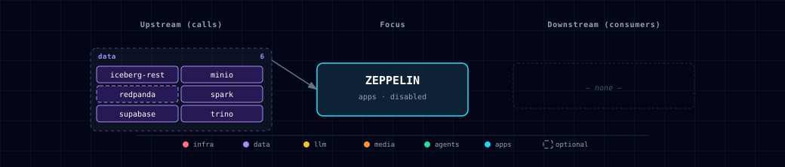

# 5.2.61. Apache Zeppelin (Spark-first notebook)

Zeppelin runs as a single container in the stack's `apps` band. The Spark interpreter is intended for the in-stack standalone Spark cluster (`spark://spark-master:7077`) plus MinIO S3A. `zeppelin-init` also seeds a Trino JDBC interpreter when `TRINO_SOURCE=container`; Supabase Postgres remains a manual JDBC profile. Notebooks live in `services/zeppelin/notebooks/`, bind-mounted into the container.

## 1. Overview

Image: `apache/zeppelin:0.12.1` (Apache 2.0), wrapped by `services/zeppelin/build/Dockerfile` so `/opt/spark` contains the matching Spark 4.1.2 runtime plus S3A and Iceberg lakehouse jars. All interpreters run in-process (no Kubernetes interpreter isolation). The Spark interpreter is the headline.

The wrapper also removes the interpreters and plugins that Atlas never configures:
- the Alluxio, BigQuery, Cassandra, Elasticsearch, Neo4j, R and SPARQL interpreters;
- the Docker and Kubernetes interpreter launchers;
- the Azure, GCS and S3 notebook repositories.

It also replaces the server's Jackson and BouncyCastle jars with checksum-pinned 2.18.11 and 1.86 releases. Spark, JDBC (`%postgres`, `%trino`), Markdown, Python and the other stock interpreters are unchanged. To restore a removed interpreter, drop it from that Dockerfile's removal list; the build fails if a base-image bump moves any listed path.

**Hard requirement:** Zeppelin needs `SPARK_SOURCE != disabled`. If you pick `ZEPPELIN_SOURCE=container` without Spark, the bootstrapper stops with an actionable error.

### 1.1. Spark backend

The Zeppelin Backend Decision (`docs/strategy/zeppelin-spark-backend-decision.md`) selects the standalone Spark interpreter path. Zeppelin submits to `spark://spark-master:7077` through `spark-submit` in client mode. The stack should not require `%spark` Scala to use Spark Connect: Spark 4 rejects `spark.remote` together with master or deploy-mode settings. JupyterHub remains the Spark Connect notebook path (`SPARK_REMOTE` or `SparkSession.builder.remote(...)`).

- `spark.cores.max` is `ZEPPELIN_SPARK_CORES_MAX` (default 1). The interpreter is long-lived. Without the cap it holds every free worker core, and Airflow cluster-mode submits wait. `zeppelin-init` re-seeds the value on each start, so change it in `.env`, not in the interpreter UI.
- `format("kafka")` does not work from `%spark`. The driver runs in Zeppelin, and Zeppelin's Spark runtime has no Kafka connector jars (open issue #1376).

### 1.2. Zero-touch Spark interpreter seeding

`zeppelin-init` waits for the Zeppelin REST API, updates the stock `spark` interpreter setting, restarts it, and exits. It is idempotent: rerunning it preserves user-owned properties while overwriting Atlas-owned Spark/lakehouse values.

Seeded values include:

- `SPARK_HOME=/opt/spark`
- `spark.master=spark://spark-master:7077`
- `zeppelin.spark.enableSupportedVersionCheck=false`
- `spark.submit.deployMode=client`
- `spark.driver.host=zeppelin` and `spark.driver.bindAddress=0.0.0.0`
- `PYSPARK_DRIVER_PYTHON=/opt/conda/envs/pyspark/bin/python` (CPython 3.10), `PYSPARK_PYTHON=python3` for the executors, and `zeppelin.pyspark.useIPython=false`
- MinIO S3A settings for `s3a://` reads/writes and Spark event logs
- `spark.sql.catalog.lakehouse.uri=http://iceberg-rest:8181` and the rest of the Iceberg REST catalog settings for `lakehouse`

Manual recovery path: open Zeppelin at `http://localhost:${ZEPPELIN_PORT}`, go to top-right user menu → **Interpreter** → `spark`, and verify the values above. Click **Save**, then confirm the restart prompt if you make changes.

### 1.3. Verify it works

In a new notebook, run a `%spark` (Scala) cell:

```scala
%spark
println(spark.version)                 // prints the cluster's Spark version (4.1.x)
spark.range(5).selectExpr("id * id as sq").show()
```

…and a `%spark.pyspark` (Python) cell:

```python
%spark.pyspark
spark.sql("SELECT 1 + 1 AS result").show()
```

If both return values, the notebook is talking to the standalone Spark cluster. (The starter notebook `notebooks/spark_basics.zpln` in §5 does the same checks plus an s3a round-trip.)

With Iceberg REST enabled, a `%spark.sql` cell can validate the lakehouse catalog:

```sql
%spark.sql
SHOW NAMESPACES IN lakehouse
```

With Trino enabled, `zeppelin-init` creates a named JDBC interpreter profile called `trino`. Use `%trino` in Zeppelin 0.12.1:

```sql
%trino
SHOW CATALOGS;
SHOW SCHEMAS FROM lakehouse;
```

Use `%trino`, not `%jdbc(trino)`: Zeppelin 0.12.1 uses the interpreter name as the paragraph prefix for created JDBC profiles.

### 1.4. MinIO (s3a) and Spark History

The seeded interpreter carries the stack's storage settings, so notebooks need no credentials:

- `s3a://` uses `spark.hadoop.fs.s3a.*` with MinIO at `http://minio:9000`, the scoped `MINIO_SPARK_*` account and path-style access.
- Event logs go to `s3a://<MINIO_BUCKET_SPARK_HISTORY>/` (default `spark-history`). View them in the Spark History UI (`SPARK_HISTORY_PORT`).
- The `lakehouse` catalog uses `http://iceberg-rest:8181` and warehouse `s3a://<MINIO_BUCKET_ICEBERG_LAKEHOUSE>/` (default `lakehouse`).

### 1.5. Driving Zeppelin from VS Code

Zeppelin speaks its own REST + websocket protocol, not the Jupyter kernel protocol, so VS Code's built-in Jupyter extension cannot connect to it. The community **"Zeppelin Notebook"** extension ([`AllenLi1231.zeppelin-vscode`](https://marketplace.visualstudio.com/items?itemName=AllenLi1231.zeppelin-vscode)) renders `.zpln` files and runs paragraphs against the same Spark interpreter as the web UI. Point it at `http://localhost:${ZEPPELIN_PORT}` (no credentials; see §2), through an SSH tunnel for a remote host. The Marketplace page lists setup steps and caveats. The browser UI (§2) is the dependable fallback.

## 2. Access

| Surface | URL | Auth |
|---|---|---|
| Direct | `http://localhost:${ZEPPELIN_PORT}` | None; the published port is always bound to `127.0.0.1`. |

No authentication ships pre-configured, so Atlas does not publish Zeppelin through Kong and does not honor a wider `HOST_BIND_IP` for this service. Configure Zeppelin authentication before you add any external reverse-proxy route.

From another machine, tunnel the loopback port, then open `http://localhost:<ZEPPELIN_PORT>`:

```bash
ssh -L <ZEPPELIN_PORT>:127.0.0.1:<ZEPPELIN_PORT> <user>@<atlas-host>
```

Zeppelin 0.12.1 refuses a state-changing REST request or a websocket from another origin (403). It accepts an origin whose host is `localhost` (any port) and the origins in `ZEPPELIN_ALLOWED_ORIGINS`. Atlas sets these to `http://localhost:<ZEPPELIN_PORT>` and `http://127.0.0.1:<ZEPPELIN_PORT>`. If the tunnel uses another local port, open Zeppelin at a `localhost` URL.

## 3. Configuration

```bash
ZEPPELIN_SOURCE=disabled           # container | disabled
ZEPPELIN_IMAGE=apache/zeppelin:0.12.1
ZEPPELIN_INIT_IMAGE=python:3.12.13-alpine
ZEPPELIN_PORT=                     # auto-assigned (apps band)
ZEPPELIN_SPARK_CORES_MAX=1         # spark.cores.max for the interpreter (§1.1)
ZEPPELIN_MEMORY_LIMIT=2g           # container limits
ZEPPELIN_CPU_LIMIT=1.5
ZEPPELIN_DB_USER=atlas_zeppelin    # read-only Postgres role for the manual JDBC profile
ZEPPELIN_DB_PASSWORD=              # auto-generated
```

## 4. Integration with the stack

- **Spark** (required) — `%spark` cells use the standalone Spark interpreter path selected in the Zeppelin backend decision: `SPARK_HOME` plus `spark.master=spark://spark-master:7077`.
- **MinIO** — `s3a://` credentials come from the generated `MINIO_SPARK_*` service account. It is limited to the Spark event-log and lakehouse workflow buckets; Zeppelin never receives MinIO root credentials.
- **Iceberg REST** (optional) — when `ICEBERG_REST_SOURCE=container`, the seeded `lakehouse` catalog points to `http://iceberg-rest:8181` and uses the scoped Iceberg MinIO credentials for S3FileIO.
- **Trino** (optional) — when `TRINO_SOURCE=container`, `zeppelin-init` waits for `http://trino:8080/v1/info`. It then creates or updates a named JDBC interpreter profile `trino` (group `jdbc`) with `default.driver=io.trino.jdbc.TrinoDriver`, `default.url=jdbc:trino://trino:8080/lakehouse`, `default.user=atlas`, and dependency `io.trino:trino-jdbc:482`. Then `%trino SHOW CATALOGS` works without manual UI setup. Trino still requires `MINIO_SOURCE=container` and `ICEBERG_REST_SOURCE=container`; if `TRINO_SOURCE=disabled`, the init script logs a skip and leaves existing JDBC settings alone.
- **Supabase Postgres** — the container receives JDBC details for the read-only `ZEPPELIN_DB_USER` role (`ZEPPELIN_JDBC_POSTGRES_URL` / `_USER` / `_PASSWORD`), but Zeppelin does not auto-bind them to a JDBC interpreter. One-time manual setup is required: create a `postgres` JDBC interpreter in the Zeppelin UI with those values.
- **LiteLLM** (optional) — Python interpreter can call the LiteLLM gateway via `openai.OpenAI(base_url="http://litellm:4000/v1", api_key=...)`. No pre-configuration ships; users wire it themselves.

## 5. Starter notebook

`services/zeppelin/notebooks/spark_basics.zpln` ships pre-loaded. 5 cells:
1. Spark version check (`spark.version`)
2. Markdown intro
3. MinIO round-trip via S3A (`s3a://<MINIO_BUCKET_SPARK_HISTORY>/...`, default `spark-history`)
4. Trino JDBC metadata smoke via `%trino` (`SHOW CATALOGS`; `SHOW SCHEMAS FROM lakehouse`) when `TRINO_SOURCE=container`
5. Postgres JDBC `SELECT version()` against supabase-db. It needs the one-time `postgres` interpreter setup in §4; until then it errors with "Interpreter not properly configured".

Use it as a template for your own notebooks.

`services/zeppelin/notebooks/iceberg_advanced_sql.zpln` is the opt-in
standalone Spark counterpart to JupyterHub's Spark Connect advanced smoke,
covering Iceberg's MERGE/branching/streaming/maintenance surface. Its
streaming paragraph writes to the buckets named by `MINIO_BUCKET_ICEBERG_LANDING`
and `MINIO_BUCKET_ICEBERG_CHECKPOINTS`. Run it
from the Zeppelin UI or from the repository root:

```bash
scripts/smoke-iceberg-advanced-sql.sh zeppelin
```

This `data-eng` / `all` track smoke adds no new service, SOURCE, or port. It
requires `SPARK_SOURCE`, `ICEBERG_REST_SOURCE`, `MINIO_SOURCE`, and
`ZEPPELIN_SOURCE` all set to `container`. See
[`docs/operations/iceberg-advanced-smoke.md`](../../docs/operations/iceberg-advanced-smoke.md)
for the full feature list this smoke exercises.

## 6. Dependencies & Integrations

### 6.1. Current — Upstream (this service calls)

| Service | Category | Status |
|---|---|---|
| iceberg-rest | data | current |
| minio | data | current |
| redpanda | data | optional: Kafka jars not bundled (#1376); Atlas passes only SPARK_KAFKA_BOOTSTRAP_SERVERS |
| spark | data | current |
| supabase | data | current |
| trino | data | current |

### 6.2. Current — Downstream (services that call this)

_No downstream consumers._

### 6.3. Architecture diagram



[Open the full-size diagram](./architecture.html) for a full-screen view.

### 6.4. Future — Missing pair integrations

_No high-confidence opportunities identified._

### 6.5. Future — Candidate new services

_No high-confidence opportunities identified._

### 6.6. Future — Unused features in this service

_No high-confidence opportunities identified._

## 7. Troubleshooting

- **Spark interpreter says "no master URL"** — the container and the `spark` interpreter must both use `spark://spark-master:7077`. Check the container with `docker exec ${PROJECT_NAME}-zeppelin env | grep SPARK_MASTER`, and check `spark.master` in the interpreter settings. Rerun `./start.sh` to restore both, because `zeppelin-init` re-seeds the interpreter.
- **First `%spark` cell after stack-up errors with "connection refused"** — Zeppelin waits for `spark-master` to be healthy and `spark-init` to complete. A cold Spark worker or a freshly restarted interpreter can still need a few seconds before it accepts driver and executor traffic. Confirm `spark.master=spark://spark-master:7077` in the `spark` interpreter settings, then re-run the cell once the Spark master UI shows a live worker.
- **S3A: "Access Denied" on s3a://...** — the generated `MINIO_SPARK_ACCESS_KEY` / `MINIO_SPARK_SECRET_KEY` or scoped policy is missing from the container. `docker exec ${PROJECT_NAME}-zeppelin env | grep -E 'MINIO|SPARK_SUBMIT_OPTIONS'` to confirm. Re-run `./start.sh` to provision the account and refresh the interpreter.
- **JDBC interpreter "Interpreter not properly configured"** — Zeppelin does not auto-bind the `ZEPPELIN_JDBC_POSTGRES_*` env vars to a JDBC interpreter profile. Walk through §4's one-time UI setup, then restart it (Interpreter → postgres → Restart). Supabase Postgres also must be running (it's a required dep of the stack).
- **`%trino` is missing or cannot load the driver** — confirm both `ZEPPELIN_SOURCE=container` and `TRINO_SOURCE=container`, then check `docker logs ${PROJECT_NAME}-zeppelin-init`. The init script reports "trino JDBC interpreter created", "configured and restarted" or "already configured". The interpreter dependency must include `io.trino:trino-jdbc:482`.
- **`%spark.pyspark` fails with `Fail to bootstrap pyspark`** — PySpark 4.1 needs Python 3.10 or newer, and the stock image's own conda envs are 3.7 and 3.9. Check that the `spark` interpreter's `PYSPARK_DRIVER_PYTHON` is `/opt/conda/envs/pyspark/bin/python`; rerunning `./start.sh` re-seeds it.
  - That env is installed from the explicit conda-forge locks in `build/pyspark-env/` (one per architecture).
  - To refresh them, solve `python=3.10` against conda-forge with `CONDA_SUBDIR` set to `linux-64` and `linux-aarch64` (`conda create --dry-run --json --override-channels -c conda-forge`). Write each package's URL and md5 under `@EXPLICIT`.
  - Keep the minor release equal to the Spark image's `python3`.
- **"Notebook won't save"** — `/notebook` is bind-mounted from `services/zeppelin/notebooks/`. Confirm `services/zeppelin/notebooks/` exists and is writable by the host user. Zeppelin writes new .zpln files there.

## 8. Capabilities & limitations

Support tier: **experimental** — Capability contract declared; no cited cold-start, workflow, or upgrade qualification run yet (evidence at `v0.1.0`).

| Capability | Status | Verification | Notes |
|---|---|---|---|
| Spark-first interactive notebooks | supported | tested | Atlas bundles a matching Spark runtime and seeds the standalone Spark interpreter for Scala, PySpark and SQL paragraphs against the in-stack cluster. PySpark's driver runs a bundled CPython 3.10, the minor release the cluster's executors run. |
| MinIO and Iceberg lakehouse notebooks | partial | tested | The interpreter receives scoped S3A and Iceberg REST settings and starter notebooks, while advanced operations remain an operator-run live smoke. |
| Adaptive Trino and Postgres JDBC | partial | tested | Init seeds a Trino interpreter only when enabled, but Supabase Postgres variables still require one-time manual JDBC interpreter configuration. |
| Notebook and log persistence | partial | documented | Notebooks bind to the repository and logs use a named volume, but concurrent edits, backup, restoration, and multi-replica writer coordination are operator-owned. |
| Authenticated Zeppelin access | not-supported | tested | Zeppelin ships without authentication. It is deliberately exposed only on a fixed loopback port with no Kong route. Remote users must tunnel or configure auth before proxying it. |
| Interpreter process isolation and HA | not-supported | documented | All interpreters run in one Zeppelin container with injected lakehouse credentials; Atlas configures neither per-user sandboxing nor a replicated notebook control plane. |
